### [Return Home](../../../) | [Previous Chapter](../Chapter09) | [Next Chapter](../Chapter11)

Chapter 10: Coordinated Visualizations
=====================================

Congratulations on building your first basemap with D3! In Chapter 10, we will will apply what you have learned about D3 selections, scales, and geographic features for dynamically creating a coordinated, multiview visualization of your multivariate attribute dataset. Chapter 10 includes two long lessons and ends with Activity 10, a choropleth map with linked bubble chart:

-   In Lesson 1, we walkthrough the steps needed to dynamically join your attribute and geospatial data and then symbolize your choropleth map using a color scale. The choropleth map is added atop the basemap you completed for Activity 9. 
-   In Lesson 2, we describe how to draw a complementary bubble chart, modifying the bubble chart example from Chapter 8.

In completing the previous chapter, you should have loaded your spatial and attribute data into the browser and used projection and path generators to draw a basemap from your spatial data. 

After this chapter, you should be able to:

-   Create a choropleth map based on attribute values for a single attribute within your multivariate dataset.
-   Draw a bubble chart representing the same attribute values visualized on the map, with the bars automatically sorted from smallest to largest.

Lesson 1: Dynamic Choropleth Symbolization
----------------------------------------

### I. Joining Your Data

The first step of creating a dynamic choropleth map is joining your attribute data to your geospatial data using a common attribute. In Chapter 9, we instructed you to create separate geospatial and attribute datasets, with the former stored in TopoJSON format and the latter in CSV format. It is possible to store your attribute data along with the spatial data as you convert from shapefiles to GeoJSON and TopoJSON formats. However, we have structured the Chapter 9 lesson to separate these files to give you a sense of making multiple AJAX calls using the [Promise.all()](https://developer.mozilla.org/en-US/docs/Web/JavaScript/Reference/Global_Objects/Promise/all) method as well as familiarizing you with the different JSON and CSV AJAX methods in D3. Further, you often need to load geospatial data from a database or attribute data from a live stream—combining the two in browser—rather than load a single combined file.

We will accomplish the data "join" through a nested looping structure. Before writing the looping structure, check to ensure that your attribute data are correctly loading into the browser and are accessible within the DOM. Figure 1.1 shows a console log of one object from our attribute data on the left and the corresponding GeoJSON object in the DOM on the right. Confirm your attribute data have maintained their format from the CSV import.

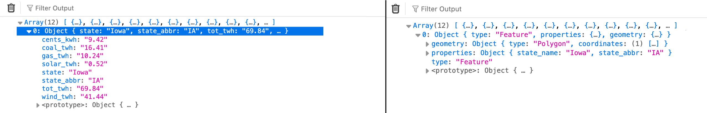

###### Figure 1.1: Data from the `greatLakesEnergyStats.csv` array object (left window) and the corresponding `midwestStates` GeoJSON object (right window) prior to joining the data in _main.js_

Note that both datasets contain the `state_abbr`. This attribute can act as a primary key on which to join the data. As we loop through each row of our CSV data, we can use this primary key to find the matching GeoJSON feature and transfer the other attributes to it (Example 1.1).

###### Example 1.1: Joining CSV data to GeoJSON enumeration units in _main.js_

        //translate midwest states TopoJSONs
        var usStates = topojson.feature(statesData, statesData.objects.usStates),
            midwestStates = topojson.feature(midwestData, midwestData.objects.midwestStates).features;

        //variables for data join
        var attrArray = ["coal_twh","gas_twh","wind_twh","solar_twh","cents_kwh","tot_twh"]; 
      
        //loop through csv to assign each set of csv attribute values to geojson states
        for (var i = 0; i < csvData.length; i++) {
            var csvState = csvData[i]; //the current state
            var csvKey = csvState.state_abbr; //the CSV primary key

            //loop through geojson states to find correct state
            for (var a = 0; a < midwestStates.length; a++) {
                var geojsonProps = midwestStates[a].properties; //the current state geojson properties
                var geojsonKey = geojsonProps.state_abbr; //the geojson primary key

                //where primary keys match, transfer csv data to geojson properties object
                if (geojsonKey == csvKey) {
                //assign all attributes and values
                attrArray.forEach(function (attr) {
                    var val = parseFloat(csvState[attr]); //get csv attribute value
                    geojsonProps[attr] = val; //assign attribute and value to geojson properties
                });
                }
            }
        }

This is one of many possible ways to accomplish the data join. If you choose to experiment with other implementations, it is important that the outcome be similar to what is shown on the right side of Figure 1.2, which is the same GeoJSON feature as in Figure 1.1 after completing the join:

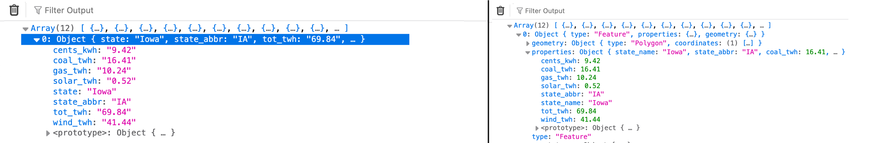

###### Figure 1.2: Data from a `greatLakesEnergyStats.csv` array object (left window) and the corresponding `midwestStates` GeoJSON object (right window) after joining the data in _main.js_

Compare the other attributes that have appeared in the GeoJSON feature properties in Figure 1.2 to the data in the CSV feature. The numbers are identical, but note that all CSV attribute values are strings, whereas the numerical attributes in the GeoJSON feature are numbers. To work with a D3 linear scale, your attribute data <ins>**_must_**</ins> be typed as numbers—hence the use of the `parseFloat()` JavaScript method to change the CSV strings into numbers as they are transferred (Example 1.1 line 24).

> ### **Join your CSV data to your GeoJSON features. Check the results of your data join script against the GeoJSON data structure on the right side of Figure 1.2. If your script does not produce similar results, use Example 1.1 to determine where the problem may lie.**

### II. Advanced JavaScript: From Global to Local

We will now take a brief but important diversion into computer programming best practice. Starting with our color scale, we are building a number of functions that make use of the array of attribute names (`attrArray`) and the `expressed` attribute. Passing these variables between functions as parameters quickly becomes overly complicated. For convenience, we can move these variables to the top of the script to make them globally accessible. While this seems straightforward, it actually brings up a hidden, generally not-well-understood aspect of JavaScript. To become a skilled web developer and avoid problems when building more complicated web apps down the road, it is important to grasp this next part.

Advanced web programmers consider it bad practice to use global variables and functions. The reason has to do with the concept of [**scope**](https://en.wikipedia.org/wiki/Scope_(computer_science)) in JavaScript. So far, we have succumbed to this less-than-ideal practice by defining most of our functions in the _**global scope**_, the segment of code execution where any entity is visible to the entire program. Every variable and function defined within a function is automatically moved to the _**local scope**_ (also called the _**function scope**_), in which it is only visible to other functions and variables within the parent function. There are times when you may want to keep variables in the global scope—as when you want them to be accessible from multiple _.js_ files all linked to _index.html_. Doing this also can prevent these variables from being "cleaned up" when they are no longer needed, resulting in an unnecessary demand on your computer memory that slows down your application.

If you want a more thorough understanding, there are many online resources that explain the difference between global and local in JavaScript and why defining variables in the global scope is generally a not a good idea. [This W3C wiki page](http://www.w3.org/wiki/JavaScript_best_practices#Avoid_globals) makes the case concisely and lays out a few alternatives for when you need variables to be globally available. In Example 1.2, we implement the last alternative listed, wrapping all of our script in a self-executing anonymous function to move our script from the global scope into the local scope. Our "global" variables—which will really be operating in the local scope—then can be defined immediately within the wrapper function.

###### Example 1.2: Defining `attrArray` and `expressed` as pseudo-global variables in _main.js_

    //First line of main.js...wrap everything in a self-executing anonymous function to move to local scope
    (function(){
    
	//pseudo-global variables
     //list of attributes
	var attrArray = ["coal_twh","gas_twh","wind_twh","solar_twh","cents_kwh","tot_twh"];
	var expressed = attrArray[0]; //initial attribute

	//begin script when window loads
    window.onload = setMap();
    
    ... //the rest of the script
    
    })(); //last line of main.js

Let's also tidy up our script by moving some of our code that performs specific tasks out of the callback function and into separate functions (Example 1.3).

###### Example 1.3: Subdividing the callback script into multiple functions in _main.js_

    //set up choropleth map
    function setMap(){
    
        //...MAP, PROJECTION, PATH, AND QUEUE BLOCKS FROM CHAPTER 8
    
        function callback(data){	
			
            var csvData = data[0], statesData = data[1], midwestData = data[2];

			//translate midwest states TopoJSON
			var usStates = topojson.feature(statesData, statesData.objects.usStates),
				midwestStates = topojson.feature(midwestData, midwestData.objects.midwestStates).features;

			//add us state to map
			var states = map.append("path")
				.datum(usStates)
				.attr("class", "us")
				.attr("d", path);

            //join csv data to GeoJSON enumeration units
			midwestStates = joinData(midwestStates, csvData);

            //add enumeration units to the map
			setEnumerationUnits(midwestStates, map, path);

        };
    }; //end of setMap()
    
    function setGraticule(map, path){
        //...GRATICULE BLOCKS FROM CHAPTER 8
    };
    
    function joinData(midwestStates, csvData){
        //...DATA JOIN LOOPS FROM EXAMPLE 1.1
    
        return midwestStates;
    };
    
    function setEnumerationUnits(midwestStates, map, path){
        //...STATES BLOCK FROM CHAPTER 8
    };

In Example 1.3, we moved three tasks into their own functions. The loops used to accomplish the CSV to GeoJSON attribute data transfer are moved to `joinData()`, which returns the updated `midwestStates` GeoJSON features array. Finally, the `states` block that adds our enumeration units to the map is moved to its own `setEnumerationUnits()` function. For each of these functions, the variables needed by the script within the function are passed to it as function parameters.

> ### **Move your attribute array and `expressed` variables to the top of _main.js_, encapsulate your script within a self-executing anonymous wrapper function, and group tasks within the callback into their own defined functions.**

### III. Creating a Color Scale

The next step toward creating our choropleth map is to build a color scale that we will use to visualize our attribute data on the map. You worked with a linear color scale in Chapter 7, Lesson 3 that created an unclassed color scheme. You should use a classed color scheme for your D3 map using 4-7 classes based on recommendations in cartography. There are multiple classification methods for classed choropleth maps. Three common schemes are easy to implement in D3: quantile, equal interval, and natural breaks. Your choropleth map should be classed, but which classification method you choose depends on the structure of your data. 

-   _**Quantile**_ classification places an equal number of data values in each class, and works best when you want to create a map with the same number of enumeration units in each class but do not care about how wide the class ranges are. Quantile also works well for data measured on an ordinal scale as well as for comparison of multiple variables measured in different units (which might be the case for your D3 map multivariate dataset).
    
-   _**Equal interval**_ classification breaks the data into classes with equal ranges (e.g., 0-10, 10-20, 20-30, etc.). Equal interval produces the easiest to understand legend but works best for data that are spread uniformly across the entire data range.
    
-   _**Natural Breaks**_ classification uses an algorithm (typically Jenks) based on minimizing the statistical distances between data points within each class, emphasizing clusters within the data.
    

It is also possible to implement a piecewise scale wherein you manually manipulate the breakpoints of the data. For a refresher on classification, review the [Statistical Mapping](https://gistbok-topics.ucgis.org/CV-03-005) entry of the GIS&T Body of Knowledge.

The following examples demonstrate how to create each of theses three classification schemes. <ins>_**Choose only one of these classification methods**_</ins> to implement for your choropleth map based on your dataset. Switching between classification schemes is an example of the _resymbolize_ operator.

We start by building a quantile color scale. To keep our code neat, we can create the color scale generator in a new function, which makes use of our attribute data from the `callback()` function (Example 1.4).

###### Example 1.4: Creating the quantile color scale generator in _main.js_

            //create the color scale
            var colorScale = makeColorScale(csvData);
    
            //Example 1.3 line 24...add enumeration units to the map
            setEnumerationUnits(midwestStates, map, path, colorScale);
        };
    }; //end of setMap()
    
    //...EXAMPLE 1.3 LINES 29-41
    
    //function to create color scale generator
    function makeColorScale(data){
        var colorClasses = [
            "#D4B9DA",
            "#C994C7",
            "#DF65B0",
            "#DD1C77",
            "#980043"
        ];
    
        //create color scale generator
        var colorScale = d3.scaleQuantile()
            .range(colorClasses);
    
        //build array of all values of the expressed attribute
        var domainArray = [];
        for (var i=0; i<data.length; i++){
            var val = parseFloat(data[i][expressed]);
            domainArray.push(val);
        };
    
        //assign array of expressed values as scale domain
        colorScale.domain(domainArray);
    
        return colorScale;
    };

In Example 1.4, we implement the color scale using [`d3.scaleQuantile()`](https://d3js.org/d3-scale/quantile#quantile_quantiles) to create a quantile scale generator (line 22). The generator takes an input domain that is either continuous or a discrete set of values and maps it to an output range of discrete values. When the domain is continuous, the output is an equal interval scale; when the domain is discrete, a true quantile scale is generated. For the range, rather than letting D3 interpolate between two colors as we did in Chapter 7, we pass an array of five color values derived from [ColorBrewer](http://colorbrewer2.org/) to the `.range()` operator (lines 13-19 and 23). These will be our five class colors in our classification scheme. (Note: You can also reference ColorBrewer scales using [ColorBrewer.js](https://github.com/axismaps/colorbrewer/) or the [d3-scale-chromatic](https://github.com/d3/d3-scale-chromatic) plugin).

To build a quantile scale, we need to assign all of the attribute values for the currently expressed attribute in our multivariate dataset as the scale's domain (line 33). This requires us to build an array of these values using a loop to access the value for each feature in the dataset (lines 26-30). The function then returns the scale generator. Within the callback, we create a `colorScale` variable to accept the scale generator from the `makeColorScale()` function, passing the `csvData` into the function (line 2). We also add the `colorScale` as a parameter sent to `setEnumerationUnits()` (line 5).

When the quantile scale generator provides all values in the dataset (the `domainArray`) as its domain, it divides the values into bins that have an equal number of values and assigns each bin one of the color classes. The `d3.scaleQuantile()` method also can be used to create an equal interval scale, generating a continuous domain by passing `.domain()` an array with only two values: the minimum and maximum value of the dataset (Example 1.5).

###### Example 1.5: Creating an equal interval color scale generator in _main.js_

    //Example 1.4 line 11...function to create color scale generator
    function makeColorScale(data){
        var colorClasses = [
            "#D4B9DA",
            "#C994C7",
            "#DF65B0",
            "#DD1C77",
            "#980043"
        ];
    
        //create color scale generator
        var colorScale = d3.scaleQuantile()
            .range(colorClasses);
    
        //build two-value array of minimum and maximum expressed attribute values
        var minmax = [
            d3.min(data, function(d) { return parseFloat(d[expressed]); }),
            d3.max(data, function(d) { return parseFloat(d[expressed]); })
        ];
        //assign two-value array as scale domain
        colorScale.domain(minmax);
    
        return colorScale;
    };

Given a two-value input domain and a range array with five output values, the generator will create five bins with a equal ranges of values between the minimum and maximum. For either the quantile or equal interval scale generator, you can use the console to discover the class breaks that the scale creates by adding the statement `console.log(colorScale.quantiles())` at the bottom of the function.

The third major classification scheme, Natural Breaks, tries for a happy medium between quantile and equal interval classification, avoiding the disadvantages of each by finding "natural" clusterings of the data. If the distributions of your attribute values have long tails or several outliers, you should consider implementing a Natural Breaks classification.

To create a Natural Breaks color scale generator, we need to use a D3 [threshold scale](https://d3js.org/d3-scale/threshold#threshold-scales) instead of a quantile scale. The threshold scale generator takes the same discrete array of color strings for its range, but requires a set of specified class breaks for the domain. Thus, a threshold scale also is how you can create a scale with arbitrary class breaks. The number of class breaks in the domain array should be one less than the number of range output values. Any data values that are the same as a class break value are included in the class _above_ the break.

To create the breaks, you will need a clustering algorithm. The Jenks algorithm commonly used by cartographers formerly is not in D3, although the [Cartesian k-means](http://www.cs.toronto.edu/~norouzi/research/papers/ckmeans.pdf) (Ckmeans) algorithm functions similarly. Ckmeans does an excellent job for our purposes. If you wish to implement a Natural Breaks classification, download _simple-statistics.js_ from the link above, place it in your _lib_ folder, and add a script link to it in your _index.html_. 

###### Example 1.6: Creating a Natural Breaks color scale generator in _main.js_

    //function to create color scale generator
    function makeColorScale(data){
        var colorClasses = [
            "#D4B9DA",
            "#C994C7",
            "#DF65B0",
            "#DD1C77",
            "#980043"
        ];
    
        //create color scale generator
        var colorScale = d3.scaleThreshold()
            .range(colorClasses);
    
        //build array of all values of the expressed attribute
        var domainArray = [];
        for (var i=0; i<data.length; i++){
            var val = parseFloat(data[i][expressed]);
            domainArray.push(val);
        };
    
        //cluster data using ckmeans clustering algorithm to create natural breaks
        var clusters = ss.ckmeans(domainArray, 5);
        //reset domain array to cluster minimums
        domainArray = clusters.map(function(d){
            return d3.min(d);
        });
        //remove first value from domain array to create class breakpoints
        domainArray.shift();
    
        //assign array of last 4 cluster minimums as domain
        colorScale.domain(domainArray);
    
        return colorScale;
    };

In Example 1.6, we start with a call to `d3.scaleThreshold()` rather than `d3.scaleQuantile()` (line 12). The range remains the same (line 13), and we build a `domainArray` from all expressed attribute values as if we were implementing a quantile scale (lines 16-20). The extra step not present in the other classification schemes is to use the Simple Statistics `ckmeans()` method to generate five clusters from our attribute values (line 23). These clusters are returned in the form of a nested array, which you can see in the console if you pass `clusters` to a `console.log()` statement. We then reset the `domainArray` to a new array of break points, using JavaScript's [`.map()`](https://developer.mozilla.org/en-US/docs/Web/JavaScript/Reference/Global_Objects/Array/map) method to build a new array out of each cluster's minimum value (lines 25-27). Since the threshold scale includes each break point in the class above it, we want our array of break points to be class minimums, which we select using `d3.min()` (line 26). The final step in formatting the `domainArray` is to remove the first value of the array using the JavaScript [`.shift()`](http://www.w3schools.com/jsref/jsref_shift.asp) method, leaving the correct number of break points (4)—each of which is included by the class above it—in the `domainArray`.

Of the three classification schemes, which should we use? It depends on the distribution of our data. Figure 1.3 demonstrates the different bins created by the three classification schemes and shows where each enumeration unit's varA attribute value fits:

###### Figure 1.3: Difference between quantile and equal interval classification of the varA attribute

Notice in Figure 1.3 that mapping our example datset with an equal interval classification scheme would result in many of our enumeration units falling into one of the first two classes, a few units in each of the third and fifth classes, and none of the enumeration units falling into the fourth class for the varA attribute. The quantile scale results in every color class appearing on the map a similar number of times, but as a result groups the three highest values with the next two lowest despite a very large gap in between. Natural Breaks ensures that each class is represented but clusters the data in such a way as to minimize the gaps between data values within a single class.

> ### **Choose a choropleth classification scheme based on your dataset and create a color scale generator that implements that scheme in _main.js_.**

### IV. Coloring the Enumeration Units

Once we have constructed our color scale generator, the final step in coloring our choropleth is to apply it to our `regions` selection. We can do this by adding a `.style()` operator at the end of the `regions` block with an anonymous function that applies the `colorScale` to each datum's currently expressed attribute value to return the fill (Example 1.7 lines 13-15).

###### Example 1.7: Coloring enumeration units in _main.js_

	function setEnumerationUnits(midwestStates, map, path, colorScale) {
		//add midwest states regions to map
		var midwest = map
			.selectAll(".midwest")
			.data(midwestStates)
			.enter()
			.append("path")
			.attr("class", function (d) {
				return "midwest " + d.properties.state_abbr;
			})
			.attr("d", path)
			.style("fill", function (d) {
				return colorScale(d.properties[expressed]);
			});
	};

We now have a choropleth map (Figure 1.4)!

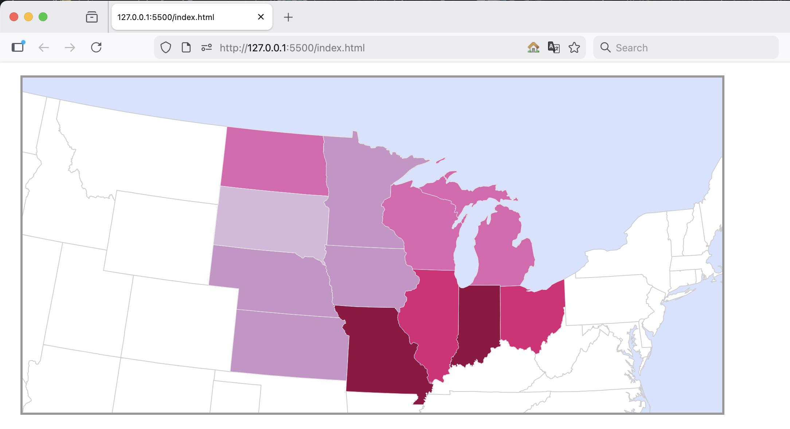

###### Figure 1.4: Colored enumeration units

This solution works fine if _every_ enumeration unit has a value for the current attribute. However, you may have some features in your dataset that do not have values for every attribute. Given the script used in Example 1.3, these may cause an error or result in some enumeration units having a default black fill. We can handle this situation by adding a conditional statement to our fill-styling block that tests for the presence of each attribute value, returns the correct color class if it exists, and returns a neutral gray if it does not (Example 1.8).

###### Example 1.8: Checking for values when setting fill in _main.js_

    function setEnumerationUnits(midwestStates,map,path,colorScale){	
        //add midwest states to map    
		var midwest = map
			.selectAll(".midwest")
			.data(midwestStates)
			.enter()
			.append("path")
			.attr("class", function (d) {
				return "midwest " + d.properties.state_abbr;
			})
			.attr("d", path)
			.style("fill", function (d) {
				//check to make sure a data value exists, if not set color to gray
				var value = d.properties[expressed];            
				if(value) {            	
					return colorScale(d.properties[expressed]);            
				} else {            	
					return "#ccc";            
				}    
			});
    }

> ### **Apply your color scale generator to your enumeration units. Make sure your script assigns a neutral color to any units with no value for the expressed attribute.**

Lesson 2: Drawing a Coordinated Visualization
---------------------------------------------

### I. Responsively Framing a Data Visualization

Next, create a _**coordinated visualization**_, linking the _reexpress_ and _retrieve_ interaction operators between the choropleth map and a second visual isomorph communicating different aspects of the attribute information. In Lesson 2, we create a simple bubble chart as our coordinated visualization; logic for linking user interactions between the map and graphic are covered in Chapter 11.

You should not feel limited to the bubble chart as your only coordinated option. If you are feeling adventurous and want to try implementing a different type of visualization, revisit the [D3 Examples Gallery](https://observablehq.com/@d3/gallery) for inspiration, looking for examples that work well with multivariate data (i.e., multiple attributes). If you do decide to stick with a bubble chart, make sure you customize its look and feel. Do _not_ simply use the default styles shown in this tutorial.

The first step in creating the coordinated visualization is to build the chart container in _main.js_. We can do this in a new function called from within the `callback()` function (Example 2.1).

###### Example 2.1: Creating the bubble chart container in _main.js_

            //Example 1.4 line 4...add enumeration units to the map
			setEnumerationUnits(midwestStates, map, path, colorScale);
    
            //add coordinated visualization to the map
			setChart(csvData, colorScale);
        };
    }; //end of setMap()
    
    //...
    
    //function to create coordinated bubble chart
    function setChart(csvData, colorScale){
        //chart frame dimensions
        var chartWidth = 550,
            chartHeight = 460;
    
        //create a second svg element to hold the bubble chart
        var chart = d3.select("body")
            .append("svg")
            .attr("width", chartWidth)
            .attr("height", chartHeight)
            .attr("class", "chart");
    };

In Example 2.1, we anticipate that we eventually will need the `csvData` and the `colorScale` to draw and color the bars, so we pass those variables as parameters to our new `setChart()` function (lines 5, 12). Within the `setChart()` function, we set a width and height for the chart (lines 14-15) and build its `<svg>` container using a `chart` block (lines 18-22). If we use the inspector, we can see our chart container on the browser page (Figure 2.1).

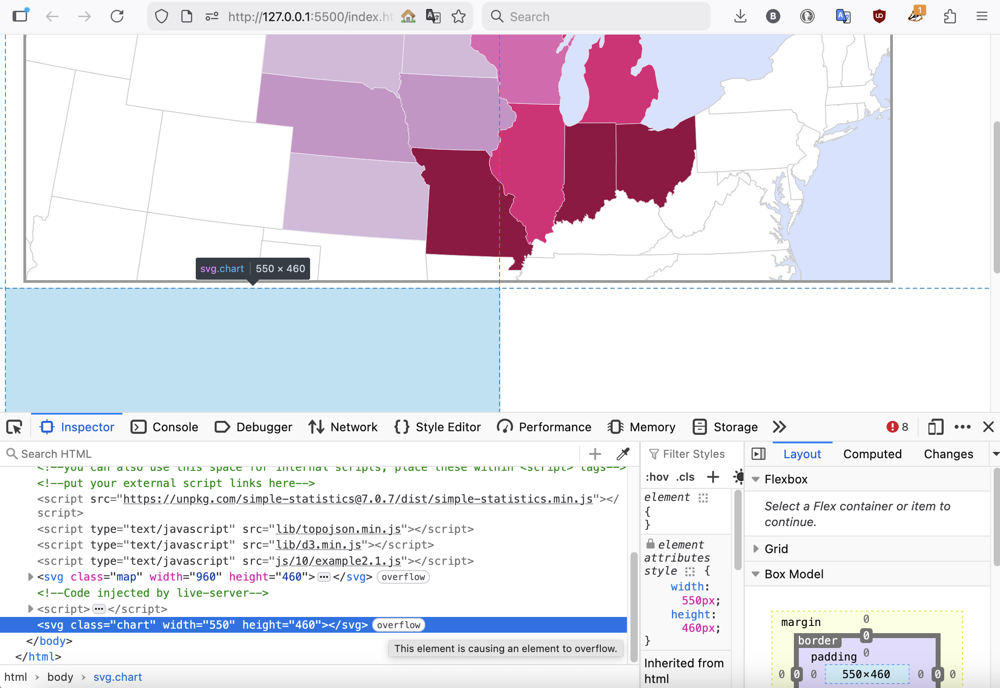

###### Figure 2.1: The bubble chart container viewed with the Inspector

It is poor UI design to have our chart appear immediately below our map on the page. Much of the utility of a coordinated visualization is in the ability of the users to see both the map and visualization at the same time so as to compare the two. Thus, our map has to become smaller so that the chart can fit next to it. While we could simply adjust the map `width` variable with a guess as to how wide the map should be, it is better to use some principles of _**responsive web design**_ to adapt the content and styling of the webpage to the user's device. If you are unfamiliar with responsive design, it may be worth reviewing the [Mobile Maps and Responsive Design](https://research.utwente.nl/en/publications/mobile-maps-and-responsive-design/) article by Britta Ricker and Robert Roth.

We can make the widths of the chart and map responsive to each other by setting each to a fraction of the browser window's `innerWidth` property, which reflects the internal width of the browser frame (Example 2.2).

###### Example 2.2: Setting responsive map and chart widths in _main.js_

    //Example 1.3 line 2...set up choropleth map
    function setMap(){
        //map frame dimensions
        var width = window.innerWidth * 0.5 - 25,
			height = 460;
    
    //...
    
    //Example 2.1 line 11...function to create coordinated bubble chart
    function setChart(csvData, colorScale){
        //chart frame dimensions
        var chartWidth = window.innerWidth * 0.5 - 25,
			chartHeight = 460;

In Example 2.2, both the map and chart frame are set to 50% of the `window.innerWidth` property, minus 25 pixels. The 25 pixel spacing leaves space for a margin on either side of the page and ensures a break point (the window width at which the chart falls below the map) that is in between common device display sizes. To make it easier to see our chart frame and fine-tune the appearance of the two frames, we can add some styles in _style.css_ (Example 2.3).

###### Example 2.3: Adding a map frame margin and chart frame styles in _style.css_

    .map {
        border: medium solid #999;
        margin: 5px 0 0 0;
        background:#D5E3FF;
    }
    /*Chapter 10 Styling*/
    .chart {
        background-color: rgba(128,128,128,.2);
        border: medium solid #999;
        float: right;
        margin: 5px 0 0 0;
    }

In Example 2.3, we add a 5-pixel top margin to the map frame (line 3). We similarly add a 5-pixel top margin (line 10). We also add a chart background color and border and make it adhere to the right side of the page, rather than abut the map frame (lines 7-9). Figure 2.2 displays the resulting responsive layout in the browser.

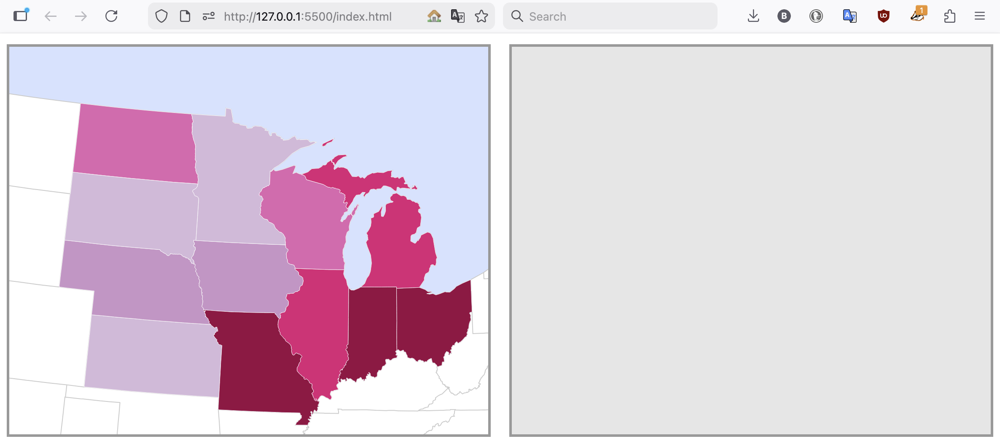

###### Figure 2.2: Even, responsive map and chart frames

If you try to resize your browser window, you will find that the frames are only "responsive" if the page is reloaded. In Chapter 11, we describe how to use event listeners to dynamically adjust the layout any time the window is resized.

> ### **Add an SVG container for your data visualization and adjust your map container size so that both fit neatly on the web page for a wide range of browser window sizes.**

### II. Adding Bubbles

To make our bubble chart, we need to adapt some of our code from Chapter 8, which we'll expand by making the chart show three variables for comparison. These will include variables for the y-axis, x-axis, and a variable that redundantly encodes both size and color. 

We'll start with `.selectAll()` block that appends a circle to the chart container for each feature. To review chapter 8, the [`<circle>`](https://developer.mozilla.org/en-US/docs/Web/SVG/Element/rect) element is used to create circles in SVG graphics. To draw the circles, we use three attributes of `<circle>`: `r` (the circle's radius), `cx` (the horizontal coordinate of the left side of the rectangle), `cy` (the vertical coordinate of the rectangle bottom). Let's start by loading our data (Example 2.4).

###### Example 2.4: Creating a bubble chart in _main.js_

        //create a second svg element to hold the bubble chart
		var chart = d3.select("body")
			.append("svg")
			.attr("width", chartWidth)
			.attr("height", chartHeight)
			.attr("class", "chart");

		//set circles for each state
		var circles = chart.selectAll(".circles") //create an empty selection
            .data(csvData) //here we feed in our array of data
            .enter() //one of the great mysteries of the universe
            .append("circle") //inspect the HTML--holy crap, there's some circles there
            .attr("class", "circles")
            .attr("class", function (d) {
                return "bubble " + d.state_abbr;
            })
            .attr("r", "10")
            .attr("cx", function (d, i) {
				return i * (chartWidth / csvData.length) + 15;
			})
            .attr("cy",25)

In Example 2.4, to make each circle just wide enough so that they all fit within the container horizontally but have gaps in between, we set the `r` attribute of each circle to 10 pixels. To spread the circles evenly across the container, we set the `cx` attribute of each bar to `i * (chartWidth / csvData.length) + 15`, where i is the index of the datum; this has the effect of moving each circle to the right of the previous one (lines 17-19). Temporarily, we set an arbitrary circle `cy` position of 25, just so the crcles are visible. We'll address the vertical attributes momentarily, but for now, let's take a look at our evenly-spaced cirles (Figure 2.3).

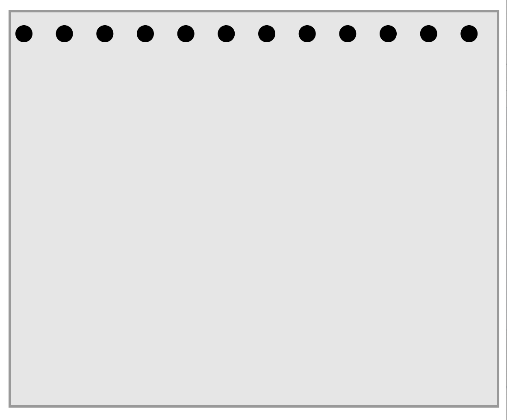

###### Figure 2.3: Evenly-spaced circles in the chart frame

Now let's select new variables for each attribute, starting with the `cy` coordinate. Recall from the Chapter 8 bubble chart example that we can use a linear scale to produce a range of output values between 0 and the chart height (Example 2.5).

###### Example 2.5: Setting the circle y-position with a linear scale in _main.js_

		//create a scale to place circles proportionally on the y-axis
		var yScale = d3.scaleLinear()
			.range([chartHeight, 0])
			.domain([0, 50]);
    
		//set circles for each state
		var circles = chart.selectAll(".circles") //create an empty selection
            .data(csvData) //here we feed in our array of data
            .enter() //one of the great mysteries of the universe
            .append("circle")
            .attr("class", "circles")
            .attr("class", function (d) {
                return "bubble " + d.state_abbr;
            })
            .attr("r", "10")
            .attr("cx", function (d, i) {
				return i * (chartWidth / csvData.length) + 15;
			})
			//place circles vertically on the chart
            .attr("cy", function(d){
				return yScale(parseFloat(d[expressed]));
			});

In Example 2.5, we create a linear `yScale`, assigning a range from 0 to the height of the chart. Because the `chart` container is drawn from top to bottom, we include the `chartHeight` as the initial variable. We also use a domain that encompasses all of our sample data attribute values from the initially expressed variable, with a little room to spare (lines 2-4). We then apply the `yScale` to each attribute value to set the circle `cy`. We use the `parseFloat()` function to ensure our data are formatted corrected as floating point variables.

We will use a similar approach to set the `cx` variable (example 2.6).

###### Example 2.6: Setting the circle x-position with a linear scale in _main.js_

        //create a y scale to place circles proportionally
        var yScale = d3.scaleLinear()
            .range([chartHeight, 0])
            .domain([0, 50]);
        //create an x scale to place circles proportionally
        var xScale = d3.scaleLinear()
            .range([0, chartWidth])
            .domain([0, 50]);

        //set circles for each state
		var circles = chart.selectAll(".circles") //create an empty selection
            .data(csvData) //here we feed in our array of data
            .enter() //one of the great mysteries of the universe
            .append("circle")
            .attr("class", "circles")
            .attr("class", function (d) {
                return "bubble " + d.state_abbr;
            })
            .attr("r", "10")
            //place circles horizontally on the chart
			.attr("cx", function (d, i) {
				return xScale(parseFloat(d[expressed]));
			})
			//place circles vertically on the chart
            .attr("cy", function(d){
				return yScale(parseFloat(d[expressed]));
			});

We can now see our attribute values are represented on both the x and y axis (Figure 2.4).

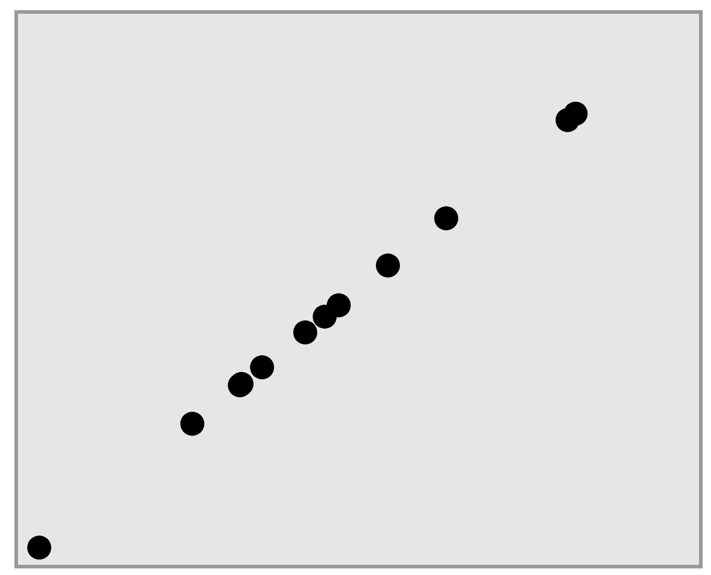

###### Figure 2.4: Bubble chart with circles positioned using the expressed attribute for both their x and y axes.

Because we're using the same variable for both axes, the resulting chart is a straight, diagonal line. To actually compare multiple variables in our dataset, we need to change how we are defining our `expressed` variables so that we can refer to multiple variables at once. We can do this by transforming the `expressed` variable into an object, with three different attributes for x-axis, y-axis, and color. While we could use three separate variables for each `expressed` attribute, this way they are all stored within a single variable (Example 2.7). 

###### Example 2.7: Redefining the `expressed` variable as an object in _main.js_

        //pseudo-global variables
        var attrArray = ["coal_twh","gas_twh","wind_twh","solar_twh","cents_kwh","tot_twh"]; //list of attributes
        //create an object for different expressed variables
        var expressed  = {
            x:attrArray[2], //x attribute
            y:attrArray[0], //y attribute
            color:attrArray[1] //color/size attribute
        }
        ......
        function makeColorScale(data) {
            ......
            //build array of all values of the expressed attribute
            var domainArray = [];
            for (var i = 0; i < data.length; i++) {
                //set variable to expressed.color
                var val = parseFloat(data[i][expressed.color]);
                domainArray.push(val);
            };
        ......
        function setEnumerationUnits(midwestStates, map, path, colorScale) {
            ......
            .style("fill", function (d) {
				//check to make sure a data value exists, if not set color to gray
				var value = d.properties[expressed.color];            
				if(value) {            	
					return colorScale(d.properties[expressed.color]);            
				} else {            	
					return "#ccc";            
				}    
			});
        ......
        function setChart(csvData, colorScale) {
            ......
            .attr("cx", function (d, i) {
				return xScale(parseFloat(d[expressed.x]));
			})
			//place circles vertically on the chart
            .attr("cy", function(d){
				return yScale(parseFloat(d[expressed.y]));
			});

As you can see, we also need to use different syntax throughout the our code whenever we refer to the expressed variable, so that we're referring to the appropriate attribute. For example, for the x-axis, when we're defining the scale, we'll use `expressed.x` (we could also use `expressed['x']`). For the color scale we use `expressed.color`. If you don't follow this syntax after transforming the `expressed` variable into an object, you will likely get errors.

Let's take a look at our chart with a different variable expressed for both the x any y-axis.

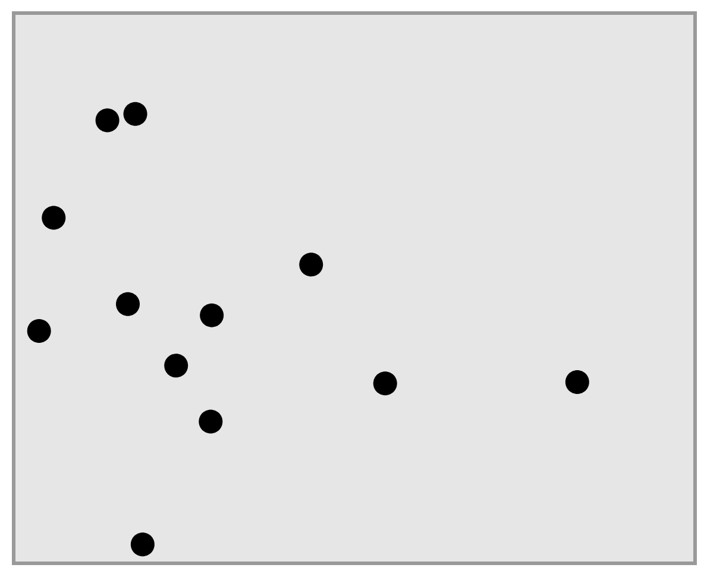

###### Figure 2.5: Bubble chart with circles positioned based two different variables for both their x and y axes.

With the positions set correctly, we also can use the fill color of each circle to match the color classes of the choropleth map. To do so, we apply our `colorScale` function to style the `fill` of the `<circle>` (Example 2.8).

###### Example 2.9: Setting the circle color using the existing color in _main.js_

    var circles = chart.selectAll(".circles")
        ......
        .attr("fill", function(d){
				return colorScale(parseFloat(d[expressed.color]));
			});

We're also going to use the size of the circle to redunantly encode the same variable we're using for color. In theory, we could use circle size to encode a fourth variable, but we'll stick with three to keep things simple.

Currently, the `r` value is set to an arbitrary value (`10`). We'll use a similar formula from our size calculation from Chapter 8, with a few minor additions (Example 2.9.).

###### Example 2.10: Setting the circle size in _main.js_

    var circles = chart.selectAll(".circles")
        ......
        .attr("r", function (d) {
            var minRadius = 2.5
            //calculate the radius based on expressed value as circle area
            var radius = Math.pow(d[expressed.color], 0.5715) * minRadius;
            return radius;
        })

To make sure no circles are too small to be seen, we create a `minRadius` value and set it to 2.5. You are encouraged to experiment with your own value. We are also using [Flannery's compensation formula](https://en.wikipedia.org/wiki/Proportional_symbol_map#Apparent_magnitude_(Flannery)_scaling) to incoporate perceptual scaling of our symbols. For reference, Flannery's formula multiplies the variable value by the power of 0.5715, which is what the `Math.pow()` function is doing.

The result is a nice bubble chart expressing three variables (Figure 2.6)!

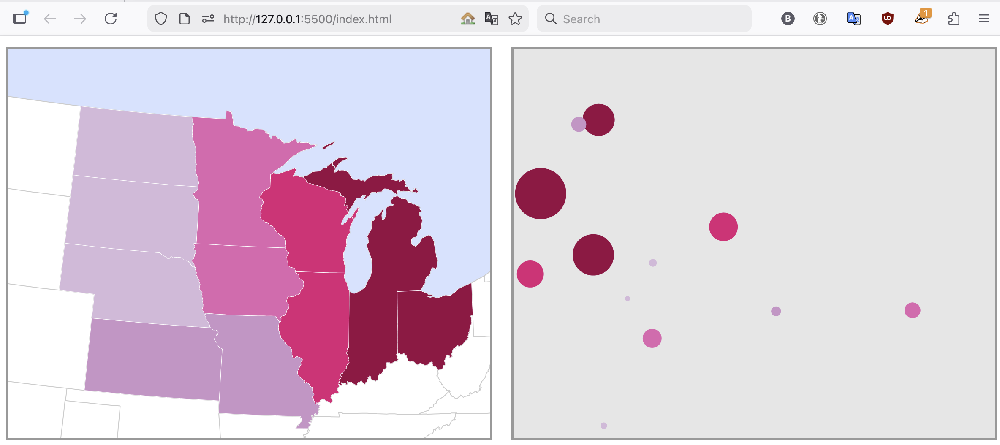

###### Figure 2.6: Choropleth map and Bubble Chart

### III. Chart Axes

As it stands, the bubble chart gives the user a better sense of the shape of our attribute dataset for the mapped attribute. However, it would be difficult to tell anything about the attribute _values_ without contextual information. Some of this information will be given to the user via the _retrieve_ operator in Chapter 11. However, just a glance at the chart should give the user a basic overview of the data range. Thus, we need to add axes to the the chart, adding the important contextual information that supports interpretation of the visualization.

As you might recall from Chapter 8, adding axes should be quite simple, because we already have `xScale` and `yscale` variables, which are necessary for the generation of both axes. Chapter 8, Section III covers Axes in more detail.

We'll start by creating two axes in the `setChart` function (Example 2.10)

###### Example 3.1: Adding axes in _main.js_

        function setChart(csvData, colorScale) {
            ......
            //create a scale to place circles proportionally
            var yScale = d3.scaleLinear()
                .range([chartHeight, 0])
                .domain([0, 50]);
            //create an x scale to place circles proportionally
            var xScale = d3.scaleLinear()
                .range([0, chartWidth])
                .domain([0, 50]);

            //create axes
            //create vertical axis generator
            var yAxisScale = d3.axisRight().scale(yScale);
            var xAxisScale = d3.axisTop().scale(xScale);

            //place axis
            var yaxis = chart.append("g")
                .attr("class", "yaxis")
                .call(yAxisScale);
            
            var xaxis = chart.append("g")
                .attr("class", "xaxis")//format x axis
                .attr("transform", "translate(0," + chartHeight + ")")
                .call(xAxisScale);

Note that for the `xaxis`, we add a `transform` attribute. If we don't, our x-axis will draw just above our chart, and therefore not be visible. To remedy this, we offset the axis by the exact height of the chart. This will move it to the very bottom, which is where we want it!

If we take a look in the browser, we'll see that our axes are there, but not perfect(Figure 10.3.1)

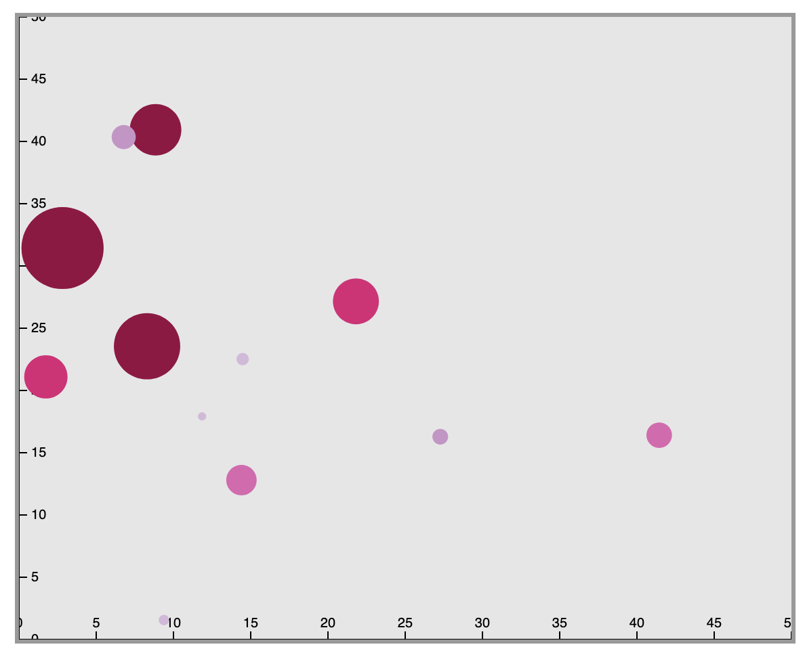

###### Figure 3.1: Bubble chart with axes labeled.

To format the axes to be more readable, we need to back up and do some refactoring.

So far, we've been using manual, or hard-coded, values for our `xScale` and `yScale` domains. These have served us well, but as we move forward, we'll want to calculate minimum and maximum values of our expressed variables programmatically. This will be especially important in Chapter 11 when we incorporate the `reexpress` interaction, since different attributes have different value ranges.

Let's start by calculating the minimum and maximum values for an expressed variable. Chapter 8 introduced the `d3.min` and `d3.max` functions that were used to easily calculate minimum and maximum values. We're going to create a function that calculates both the minimum and maximum values for a single expressed variable, and returns them in the form of an array so that both values are accessible in a single variable.

###### Example 3.2: Adding a function to calculate minimum and maximum variable values in _main.js_

    //add function to calculate the minimum and maximum values for expressed variables
	function getDataValues(csvData, expressedValue) {
        var max = d3.max(csvData, function(d) { 
            return parseFloat(d[expressedValue]); 
        });
        var min = d3.min(csvData, function(d) { 
            return parseFloat(d[expressedValue]); 
        });
        var range = max - min,
            adjustment = (range / csvData.length)

        return [min - adjustment, max + adjustment];
    }

There are two parameters to the `getDataValues()` function, `csvData`, which is the input dataset, and `expressedValue`, which represents the expressed attribute we will use to calculate minimum and maximum values. Within each function, we use `d[expressedValue]` to access our chosen expressed variable from within the CSV dataset.

We are also calculating an `adjustment` variable, which will create a buffer around the edges of the chart so that no circles are cut off. To do so, we calculate the total `range` of data, then divide that by the number of variables in our dataset. Ultimately, this will create a decent-sized buffer around the edges of the chart.

Next, we're going to move the `yScale` and `xScale` declarations into their own functions, which will each include reference to the new `getDataValues()` function.

###### Example 3.3: Calculating `xScale` and `yScale` using new functions in _main.js_

	//function to create y scale
	function createYScale(csvData, chartHeight){
		var dataMinMax = getDataValues(csvData, expressed.y)
		return yScale = d3.scaleLinear().range([0, chartHeight]).domain([dataMinMax[1], dataMinMax[0]]);
	}
	//function to create x scale
	function createXScale(csvData, chartWidth){
		var dataMinMax =  getDataValues(csvData, expressed.x)
		return xScale = d3.scaleLinear().range([0, chartWidth]).domain([dataMinMax[0], dataMinMax[1]]);
	}

    //function to create coordinated bubble chart
	function setChart(csvData, colorScale) {
		......
		//create a scale to place circles proportionally
		var yScale = createYScale(csvData,chartHeight)
        //create an x scale to place circles proportionally
		var xScale = createXScale(csvData, chartWidth);

In Example 3.3, we create two new functions, `createYScale` and `createXScale`. Each function inputs two variables, the `csvData`, and the size of the chart (`chartHeight` for the y-scale, and `chartWidth` for the x-scale). We then calculate the minimum and maximum values of the inputted variable using the appropriate expressed variable. For example, in the `createYScale()` function, we calculate minimum and maximum values for the `expressed.y` attribute. 

Because the output of the `getDataValues()` is an array, the minimum value is stored as `dataMinMax[0]`, while the maximum value is stored as `dataMinMax[1]`. In both functions, we use these values to create linear scales, based on the chart sizes, incorporating minimum and maximum values into the domain. For the y-scale, we go from maximum to minimum `.domain([dataMinMax[1], dataMinMax[0]])`, and the x-scale from maximum to minimum `domain([dataMinMax[0], dataMinMax[1]])`. Again we do this because our y scale is drawn from top to bottom, meaning maximum values will be at the top, while the x-scale is drawn from left to right, meaning maximum values will be on the right.

Finally, we're going to move our axis generation into its own function, too. This function will input our `chart` svg variable, `chartHeight` for the x-axis transformation, as well as the `yScale` and `xScale` variables.

###### Example 3.4: Creating a function that generates our chart axes in _main.js_

    //create axes
    function createChartAxes(chart,chartHeight,yScale,xScale){
        //add axis
        //create axis generators
        var yAxisScale = d3.axisRight().scale(yScale);
        var xAxisScale = d3.axisTop().scale(xScale);

        //place axis
        var yaxis = chart.append("g")
            .attr("class", "yaxis")
            .call(yAxisScale);
            
        var xaxis = chart.append("g")
            .attr("class", "xaxis")//format x axis
            .attr("transform", "translate(0," + chartHeight + ")")
            .call(xAxisScale);
    }

    function setChart(csvData, colorScale) {
		......
		//create a scale to place circles proportionally
		var yScale = createYScale(csvData,chartHeight)
        //create an x scale to place circles proportionally
		var xScale = createXScale(csvData, chartWidth);
        //create axes
        createChartAxes(chart,chartHeight, yScale, xScale)

Let's take a look at the results (Figure 10.3.2)!

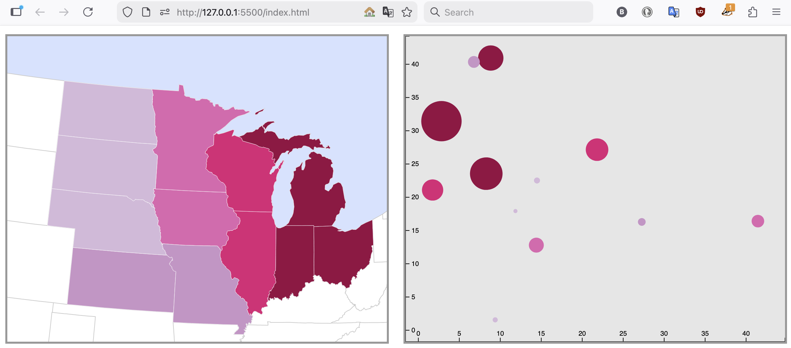

###### Figure 3.2: Bubble chart with axes nicely formatted.

We're now ready to move on to Chapter 11, and with it, _interactions_.

> ### **Create a bubble chart or alternative data visualization that clearly expresses the both attribute values shown on the choropleth map as well as one or more additional attribute variables.**

## Activity 10

1.  Join your CSV attribute data to your GeoJSON geospatial data and map one of the attributes in your Activity 9 basemap as a choropleth.
2.  Create a coordinated visualization that supports your choropleth map by providing a sensible alternative view of the data.
3.  Annotated your coordinated visualization with either one or more axes, or value labels (refer to chapter 8 for how to create value labels).
4.  Commit and sync your _unit-3_ directory with the commit message "Activity 10".

_This work is licensed under a [Creative Commons Attribution 4.0 International License](http://creativecommons.org/licenses/by/4.0/).   For more information, please contact Robert E. Roth \(reroth@wisc.edu\)._

### [Return Home](../../../) | [Previous Chapter](../Chapter09) | [Next Chapter](../Chapter11)
