### [Return Home](../../../) | [Previous Chapter](../Chapter10)

Chapter 11: Coordinated Interactions
=================================

Welcome to Chapter 11, the final set of lessons in the Web Mapping workbook! In Chapter 11, we discuss coordinating interactions in D3 between your choropleth map and linked visualization. Chapter 11 includes two lessons, plus an optional third lesson, and concludes with your final D3 coordinated visualization: 

*   In Lesson 1, we implement the _reexpress_ operator for changing the visualized attribute using the menu selection interface style. Lesson 1 also introduces some basic page styling and layout to improve the interface design.
*   In Lesson 2, we implement a _retrieve_ operator linked between the map and visualization.
*   In Optional Lesson 3, we do some interface styling to improve our design.

After this chapter, you should be able to:

*   Implement the _reexpress_ operator using menu selection to change the attribute in both the map and linked visualization.
*   Implement the _retrieve_ operator using direct manipulation to link enumeration units on the map to elements in the linked visualization.

Lesson 1: Dynamic Attribute Selection
-------------------------------------

### I. Menu Selection (and Title Creation)

So far, we have worked with one attribute in D3 to create the map, and three in the data visualization. However, your dataset includes at least five attributes, and we want the user to be able to _reexpress_ among these attributes. In this lesson, we discuss how to implement the _reexpress_ operator using the menu selection interface style.

For your Leaflet map, you implemented the _**direct manipulation**_ interface style for your interaction operators, enabling the user to probe, drag, or click/tap graphic (non-text) interface controls or the map itself. Specifically, _retrieve_ was implemented with direct manipulation of individual map features, _pan_ and _zoom_ were implemented with direct manipulation of the entire map, and _sequence_ (and possibly _zoom_) was implemented with direct manipulation of a non-map, non-legend, non-isomorphic interface widget (i.e., the slider control).

For your D3 map, we use _menu selection_ to select one of your multivariate attributes from a list. Menu selection is considered "slightly less direct than direct", as it typically uses text rather than graphics as the _visual affordance_ for list items. However, menu selection can include graphics alongside text, such as icons representing different list items (common for mobile), or replace text entirely with graphics (e.g., a map preview). Menu selection has the advantages of lower pointing mileage and greater pointing efficiency while also constraining user interaction to a subset of options (versus the more free form fill-in). Ultimately, we are going to create three dropdown menus, one that controls the variable represented on the x-axis of your bubble chart, one for the y-axis, and one for the color/size, which will also adjust the variable expressed on the choropleth map.

Menu selection has the added advantage of being easy to implement compared to direct manipulation. We make use of a simple HTML `<select>` element for _reexpress_, which provides a dropdown menu for attribute selection. Start by adding a [`<select>`](http://www.w3schools.com/tags/tag_select.asp) dropdown menu to the DOM. 

Note that the `<select>` element is merely a container for the menu; we also need to add each value we want in the menu as an [`<option>`](http://www.w3schools.com/tags/tag_option.asp) child element. By now, you probably have some idea of how to accomplish both of these tasks using D3 selections. Example 1.1 illustrates one possible set of selection blocks.

###### Example 1.1: Adding a dropdown menu in _main.js_

    //function to create a dropdown menu for attribute selection
    function createDropdown() {
        //add select element
        var dropdown = d3.select("body")
            .append("select")
            .attr("class", "dropdown");

        //add initial option
        var titleOption = dropdown.append("option")
            .attr("class", "titleOption")
            .attr("disabled", "true")
            .text("Select Attribute");

        //add attribute name options
        var attrOptions = dropdown.selectAll("attrOptions")
            .data(attrArray)
            .enter()
            .append("option")
            .attr("value", function (d) { return d })
            .text(function (d) { return d });
    };

In Example 1.1, we create a new function, `createDropdown()`, which is called from the end of the `callback()` function (not shown). The first block appends the `<select>` element to the `<body>` (lines 4-6). 

The `titleOption` block creates an `<option>` element with instructional text to serve as an affordance alerting users that they should interact with the dropdown menu (lines 9-12). Disabling the title option ensures that the user cannot mistakenly select it (`.attr("disabled", "true")`). 

Finally, the `attrOptions` block uses the `.selectAll().data().enter()` sequence with the `attrArray` pseudo-global variable that holds an array of our attribute names, creating one `<option>` element for each attribute (lines 15-18). Each option element is assigned a `value` attribute that holds the name of the attribute, and its `text` content (what the user sees as the visual affordance) is also assigned the name of the attribute (lines 19-20).

Once we have created the dropdown menu, we need to do a little styling so that it does not simply appear below the previous element on the page. There are many different ways we could adjust the layout on the webpage, but in this case we are going to create a new element in `index.html` with a class of `.navbar`.

###### Example 1.3: Adding an `.navbar` element in _index.html_

    <body>
        <!--example 1.2-->
        

        
With the `.navbar` created, we'll want to do a bit of styling. Eventually, the `.navbar` element will contain our dropdown menus, as well as a page title. For now, we are going to position it at the top of the page and give it a light background.

###### Example 1.3: Styling our new `navbar` in _style.css_

    .navbar{
        top:0;
        left:0;
        background:lightgray;
        padding:20px;
    }

In Example 1.3, we position the menu `.navbar` using use `top` and `left` styles to position the `.navbar` element on the top-left corner of the page (lines 3-4). We then add a `background` of `lightgray`, and add a `padding` of `20px` around the edges of the `.navbar` to offset its content.

Next, we need to adjust our code to position the dropdown menu within the `.navbar`. To accomplish this, we use `d3.select()` to select the `.navbar` element, as opposed to the page `body`. 

###### Example 1.4: Adding a dropdown menu to the `.navbar` element _main.js_

    function createDropdown(csvData) {
        //add select element
        //select .navbar instead of body
        var dropdown = d3.select(".navbar")
            .append("select")
            .attr("class", "dropdown");

At this point, we can style the `.dropdown` class. 

###### Example 1.5: Styling the `dropdown` in _style.css_

    .dropdown {
        z-index: 10;
        font-family: sans-serif;
        font-size: 1em;
        font-weight: bold;
        padding: 2px;
        border: 2px solid #999;
        box-shadow: 2px 2px 4px #999;
        margin-right:15px;
    }
    
    option {
        font-weight: normal;
    }

In Example 1.5, we add a `z-index` of 10 ensures that the menu `<select>` element floats to the top of all other elements on the page (line 2). We then add `font` styles and `padding` around the text  (line 3-6). Finally, a `border` and `box-shadow` make the `<select>` element visually float above the map, making it more obvious to the user (lines 7-8). The `option` style simply reduces the text of the `<option>` elements in the menu to normal weight so they are not emboldened by the `font-weight` of the `<select>` element (lines 12-14).

The final step of formatting the `.navbar` is adding a title to the webpage.

###### Example 1.6: Adding a title to the map in _main.js_
    //create page title
    function createTitle() {
        var pageTitle = d3
            .select(".navbar")
            .append("h1")
            .attr("class", "pageTitle")
            .text("Midwest Energy Dashboard")
    }

In Example 1.6, we create a new function, `createTitle()`, which is called from the end of the `callback()` function (not shown), just above the `createDropdown()` call. We then use a `d3.select()` function to select `.navbar` and then append an `h1` element with a `class` of `pageTitle`.

We can now see our dropdown menu with each of our attribute options positioned within the `.navbar`, as well as our page title (Figure 1.1).

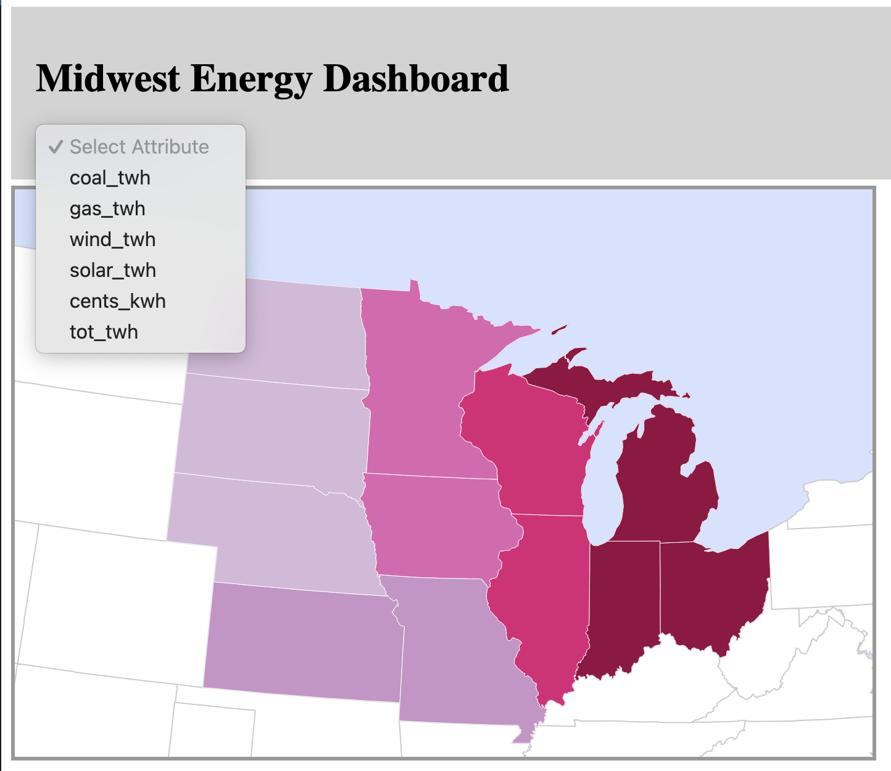

###### Figure 1.1: Attribute selection dropdown menu

### II. Menu Selection Feedback

Once implemented, we need to enable our _reexpress_ menu selection by adding an event listener to the script to listen for a user interaction and an event handler function to respond by changing the expressed attribute, thus giving _visual feedback_ to the user. Start by pseudocoding the feedback tasks (Example 1.3).

###### Example 1.7: Pseudo-code for attribute change listener

    // ON USER SELECTION:
    // Step 1. Change the expressed attribute
    // Step 2. Recreate the color scale with new class breaks
    // Step 3. Recolor each enumeration unit on the map
    // Step 4. Resize each circle on the bubble chart
    // Step 5. Recolor each circle on the bubble chart

Steps 1-3 are relatively simple to take care of within an event handler function (Example 1.8).

###### Example 1.8: Adding a change listener and handler function in _main.js_

    function callback(data){
        ////...
        createTitle();
        createDropdown(csvData);
    }
    ////...
    //function to create a dropdown menu for attribute selection
    function createDropdown(csvData){
        //add select element
        var dropdown = d3.select("body")
            .append("select")
            .attr("class", "dropdown")
            .on("change", function(){
                changeAttribute(this.value, csvData)
            });
        
        //OPTIONS BLOCKS FROM EXAMPLE 1.1
        ////...
    };
    
    //dropdown change event handler
    function changeAttribute(attribute, csvData) {
        //change the expressed attribute
        expressed.color = attribute;

        //recreate the color scale
        var colorScale = makeColorScale(csvData);

        //recolor enumeration units
        var midwest = d3.selectAll(".midwest")
        .style("fill", function (d) {
            var value = d.properties[expressed.color];
            if (value) {
                return colorScale(d.properties[expressed.color]);
            } else {
                return "#ccc";
            }
        });
    }

In Example 1.8, we add a [`.on()`](https://d3js.org/d3-selection/events#handling-events) operator to the end of the `dropdown` block to listen for a `"change"` interaction on the `<select>` element (line 13-15). In this context, `.on()` is a D3 method, but it works similarly to Leaflet's `.on()` method. We pass it an anonymous function, within which we call our new event handler, `changeAttribute()`. 

The parameters of `changeAttribute()` are the `value` of the `<select>` element (referenced by `this`), which holds the attribute selected by the user, as well as our `csvData`. The `csvData` will be used to recreate the color scale. _Note: we also need to add it as a parameter to the `createDropdown()` function (line 2) and its function call within `callback()`._

Within `changeAttribute()`, we complete Step 1 in our pseudocode by simply assigning the user-selected attribute to `expressed.color`, or the color attribute of the `expressed` object. 

For Step 2, we repeat the call to `makeColorScale()`, passing the scale generator our `csvData` and assigning the returned scale to a new `colorScale` variable. 

For Step 3, we create a selection of all enumeration units (`d3.selectAll(".midwest")`). Since the enumeration units already have our GeoJSON data attached to them as a property in the DOM, we can re-use their GeoJSON `properties` with the new `colorScale` function to reset each enumeration unit's `fill` attribute (lines 24-30).

The map should now recolor itself when a new attribute is selected from the dropdown menu (Figure 1.2).

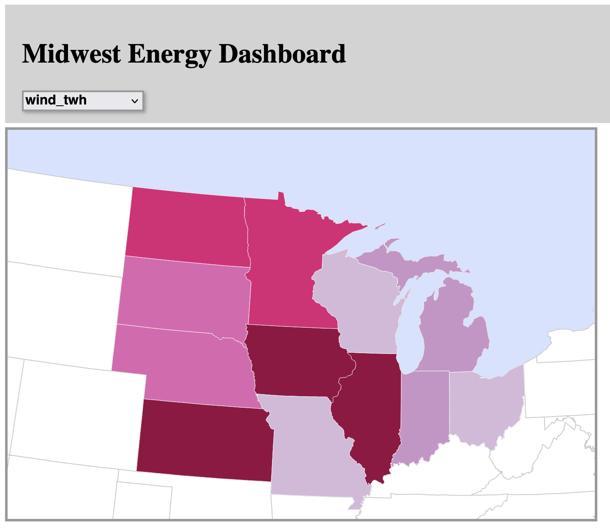

###### Figure 1.2: Dynamic attribute selection changes the choropleth

Restyling the dynamic visualization (Steps 4-5) is more challenging, but we can use the same principle of recycling a multi-element selection we used for recoloring the enumeration units on the map in Steps 1-3. 

The new block should contain a selection of all visualization elements (bars in the bar chart) and each operator that affects an aspect of the element we want to change when a new attribute is selected.

For resizing the circle (Step 4), we need the `r` attributes. Finally, for recoloring the circles (Step 5), we need the `fill` style (Example 1.9).

###### Example 1.9: Manipulating the chart bubbles on attribute change in _main.js_

    //dropdown change event handler
    function changeAttribute(attribute, csvData) {
        //change the expressed color attribute
        expressed.color = attribute;

        //recreate the color scale
        var colorScale = makeColorScale(csvData);

        //recolor enumeration units
        var midwest = d3.selectAll(".midwest").style("fill", function (d) {
            var value = d.properties[expressed.color];
            if (value) {
                return colorScale(d.properties[expressed.color]);
            } else {
                return "#ccc";
            }
        });

        //recolor bubbles
        var circles = d3.selectAll(".bubble")
            //recolor circles to match the map
            .attr("fill", function (d) {
                return colorScale(parseFloat(d[expressed.color]));
            })
            //resize circles
            .attr("r", function (d) {
                var min = 1, minRadius = 2.5
                //calculate the radius based on population value as circle area
                var radius = Math.pow(d[expressed.color] / min, 0.5715) * minRadius;;
                return radius;
            })
    }

In Example 1.9, we create a selection of all circles in our bubble chart (`d3.selectAll(".bubble")`). We then reset the `fill` attribute of each bubble to recolor them based on the newly selected attriute. To resize the bubbles, we reset the `r` attribute using the same formula from the inital creation of the bubble chart, with the new expressed attribute values (Figure 1.3).

Note that much of this code is duplicated in the `setChart()` function we created in Chapter 10. 

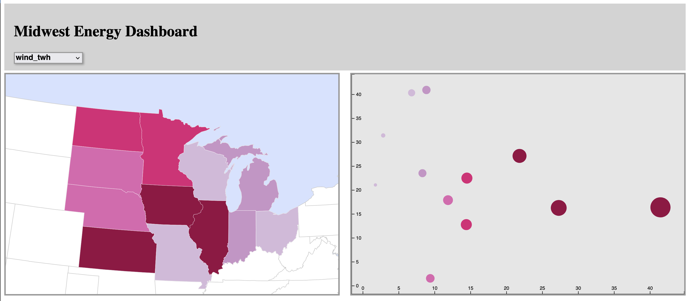

###### Figure 1.3: Updating map and chart on attribute selection.

Now that we have a `<select>` element to _reexpress_ the color of the map and the color/size of the chart, we can use same principle to create `<select>` elements to change the variable for both the x and y axes of the bubble chart. This is the perfect opportunity to resample the `createDropdown()` function so it can be called three times, creating a dropdown menu for each of the variables we want to _reexpress_.

Currently, the `createDropdown()` function is designed to only work within the context of changing the color/size of the chart—or, more specifically, `expressed.color`. Let's refactor our code so that we input `color` as the variable we want to change when we call both `createDropdown()` and `changeAttribute()`. This will involve adding a new parameter to both functions (Example 1.10).

###### Example 1.10: Adding new parameters to `createDropdown()` and `changeAttribute()` in _main.js_

    function callback(data){
        ////...
        createTitle();
        createDropdown(csvData,'color');
    }
    ////...

    //function to create a dropdown menu for attribute selection
    function createDropdown(csvData,expressedAttribute) {
        //add select element
        //select .navbar instead of body
        var dropdown = d3.select(".navbar")
            .append("select")
            .attr("class", "dropdown")
            .on("change", function () {
                changeAttribute(this.value,expressedAttribute,csvData)
        });
        ////...
    }
    //dropdown change event handler
    function changeAttribute(attribute, expressedAttribute, csvData) {
        //change the expressed color attribute
        expressed[expressedAttribute] = attribute;
    ////...
    
In Example 1.10, we add a new parameter called `expressedAttribute` to both `createDropdown()` and `changeAttribute()`. When we initially call `createDropdown()` in the `callback()` function, we pass the value `color` as the `expressedAttribute` (line 4). We pass this value as a string. If we were to pass `expressed.color` itself, the function would pass a copy of the variable, and any changes we made wouldn't change its original value. Instead, by passing `color` as a string we can eventually change the value of `expressed.color` using bracket notation:`expressed[expressedAttribute]`. In the example, this is the functional equivalent of writing `expressed['color']`, which is the same as `expressed.color`.

Next, we can use the `createDropdown()` function to create 2 additional `<select>` elements for the x- and y-axes (Example 1.11).

###### Example 1.11: Creating two new dropdowns in _main.js_

    function callback(data){
        ////...
        createTitle();
        createDropdown(csvData,'color');
        createDropdown(csvData,'y');
        createDropdown(csvData,'x');

    }

If you open the browser, you should see a row of three dropdown menus in the `<navbar>` element. However, the latter two dropdown menus currently have no function. If you recall, within `changeAttriubutes()`, we only set `<circle>` size and color to change, not their `x` and `y` position. To adjust the x and y position, we have to make several additions.

First, we need to adjust the x and y `scale` variables so the circles will be positioned correctly. If we don't adjust the scales, we will likely get circles positioned off the chart. We can use our existing functions, `createYScale()` and `createXScale()`, to do this. However, because each function requires the either `chartHeight` or `chartWidth` variables to be passed as parameters, we are going to run into a scoping issue.

Currently, both `chartHeight` and `chartWidth` are created within the `setChart()` function. To make these variables accessible to the `changeAttribute()` function, we need to move them to the top of our wrapper function, declaring them as pseudo-global variables.

Finally, we have to adjust the `cx` and `cy` attributes of each `<bubble>` element (Example 1.12). 

###### Example 1.12: Expanding `createDropdown()` in _main.js_
    (function () {
        //pseudo-global variables
        ////...
        var expressed = {
            x: attrArray[2],
            y: attrArray[0],
            color: attrArray[1]
        }
        //chart frame dimensions
        var chartWidth = window.innerWidth * 0.5 - 25,
        chartHeight = 460
        ////...
        //dropdown change event handler
        function changeAttribute(attribute, expressedAttribute, csvData) {
            //change the expressed color attribute
            expressed[expressedAttribute] = attribute;
            //recreate x and y scales based on the newly expressed value
            //update y scale
            var yScale = createYScale(csvData, chartHeight);
            //update x scale
            var xScale = createXScale(csvData, chartWidth);
            //recreate the color scale
            var colorScale = makeColorScale(csvData);
            
            //recolor enumeration units
            var midwest = d3.selectAll(".midwest").style("fill", function (d) {
                var value = d.properties[expressed.color];
                if (value) {
                    return colorScale(d.properties[expressed.color]);
                } else {
                    return "#ccc";
                }
            });

            //recolor bubbles
            var circles = d3.selectAll(".bubble")
                //recolor circles to match the map
                .attr("fill", function (d) {
                    return colorScale(parseFloat(d[expressed.color]));
                })
                //resize circles
                .attr("r", function (d) {
                    var min = 1, minRadius = 2.5
                    //calculate the radius based on population value as circle area
                    var radius = Math.pow(d[expressed.color] / min, 0.5715) * minRadius;;
                    return radius;
                })
                //calculate x and y scales
                .attr("cx", function (d, i) {
                    return xScale(parseFloat(d[expressed.x]));
                })
                .attr("cy", function (d) {
                    return yScale(parseFloat(d[expressed.y]));
                })
////...

In example 1.12, we begin by declaring `chartWidth` and `chartHeight` as pseudo-global variables. Then, within `changeAttribute`, we declared new `xScale` and `yScale` variables using the `createXScale()` and `createYScale()` functions, respectively.

Lastly, we adjust the `cx` and `cy` attributes of the `<circle>` elements using the newly re-defined scales.

If we take a look in the browser, we see that the our circles can be adjusted along both axes!

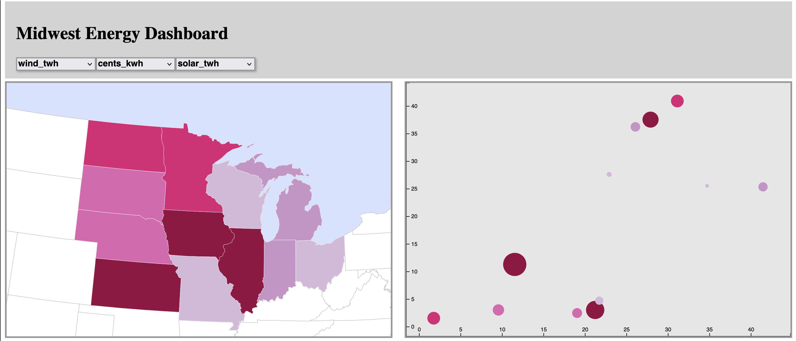

###### Figure 1.4: Attribute selection along both axes, a true multivariate graphic! 

BUT, there is a major problem with this graphic. What's wrong?

We may have adjusted the scales to update the `cx` and `cy` attributes of the `<circle>` elements, but the axes themselves are static! 

Let's update the axes (Example 1.13).

###### Example 1.13: Expanding `createDropdown()` in _main.js_
    //dropdown change event handler
    function changeAttribute(attribute, expressedAttribute, csvData) {
        ////...
        var colorScale = makeColorScale(csvData);
         //update axes
        var xaxis = d3.select(".xaxis").call()
            d3.axisTop(xScale)
        )
       var yaxis = d3.select(".yaxis").call(
            d3.axisRight(yScale)
        )

In Example 1.13, we define new variables using `d3.select(".xaxis")` and `d3.select(".yaxis")`, which will select the existing elements for the `xaxis` and `yaxis`. From there, we use the `.call()` function to access child methods and variables from within each `axis` selection. In particular the `d3.axisTop()` and `d3.axisRight()` methods allow us to redefine the axis scales using our newly calculated values. 

Examining the browser shows that our axes are now updating to match our variable selection!

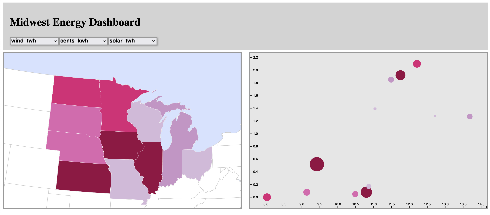

###### Figure 1.5: Our chart with updated axes!

Finally, let's make some small cosmetic adjustments so users of our linked visualization know which dropdown menu adjusts which variable. 

We can add a new parameter to the `createDropdown()` function that contains the label, then add a new element within the function to draw the label next to the menu (Example 1.14).

###### Example 1.14: Creating dropdown menu labels _main.js_

    function callback(data){
        ////...
        createTitle();
        createDropdown(csvData, "color", "Select Color/Size");
        createDropdown(csvData, "x", "Select X");
        createDropdown(csvData, "y", "Select Y");
        ////...
    }
    ////...
    //function to create a dropdown menu for attribute selection
    function createDropdown(csvData,expressedAttribute,menuLabel) {
        //BEGINNING OF FUNCTION
        //add dropdown label
        var label = d3.select(".navbar")
            .append("p")
            .attr("class", "dropdown-label")
            .text(menuLabel + ": ");
        ////...
        //add initial option
        var titleOption = dropdown.append("option")
            .attr("class", "titleOption")
            .attr("disabled", "true")
            //set default option to the initial expressed variable
            .text(expressed[expressedAttribute]);

In Example 1.14, we add another parameter to the `createDropdown()` function called `menuLabel`. We then `append()` a new `
` element into the `.navbar`, and set its text to the value of our new `menuLabel` parameter. We give this `
` element a class name of `dropdown-label`.

While we are here, we also adjust the text of the initial dropdown title option to match the initial variable. To do so, we adjust the `.text()` to be the expressed variable `expressed[expressedAttribute]`.

However, if you take a look in the browser, you'll see that two of our dropdown menus have dissapeared, and one is cut-off (Figure 1.6)!

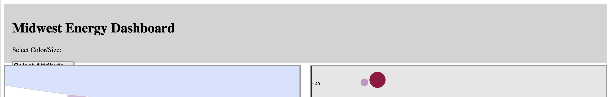

###### Figure 1.6: Missing dropdown menus! Uh-Oh!

Thankfully, to fix this we need to add a new tag to our CSS (Example 1.15).

###### Example 1.15: Styling the `dropdown` labels in _style.css_

    /*Example 1.15*/
    .dropdown-label{
        display:inline;
    }

Within CSS, the `display` property has a default value that places new elements on seperate lines of the page. By setting `display` to `inline`, we ensure the `dropdown-label` elements will be drawn on the same line with all of the dropdown menus. 

Now, if we look in our browser, we can see all of our dropdown menus, all appropriately labeled! Feel free to adjust the CSS style of the labels further.

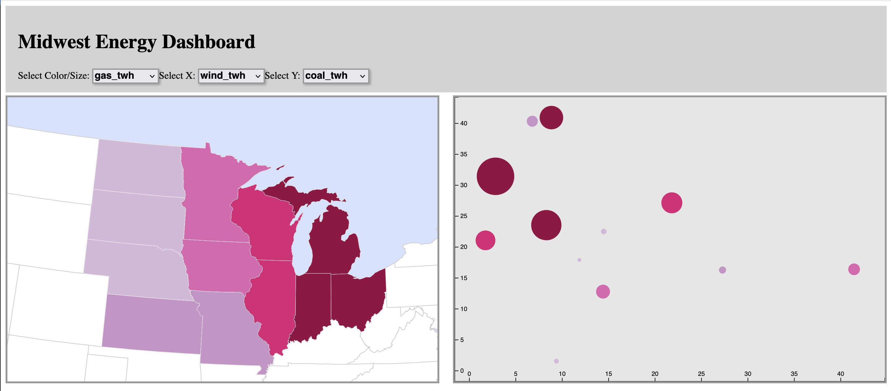

###### Figure 1.7: Interactive choropleth map and bubble chart

> ### **Implement a visual affordance that allows the user to change the expressed attribute and visual feedback that updates your choropleth map and data visualization in response to user input.**

### III. Transitions

Although our map and visualization now change their state in response to user input, that change is not always noticeable when the attributes are correlated and thus maintain relatively similar class breaks. To make the change more noticeable, we can add additional visual feedback to the user in the form of a D3 [transition](https://github.com/d3/d3-transition#d3-transition). _**Transitions**_ take advantage of the [animation capabilities](http://www.w3.org/TR/SVG/animate.html) built into the SVG specification to animate between visual states. Animated transitions guide the user's eye from one visual state to another, allowing time for the change to register cognitively. It also improves the aesthetic appeal of the graphics by making them appear to react and flow smoothly in response to user input.

We will cover only basic transitions here. You may wish to explore more deeply into transition options such as different types of [easing](https://github.com/d3/d3-ease#d3-ease) and [interpolation](https://github.com/d3/d3-interpolate#d3-interpolate). Each of these options has a default behavior that D3 implements automatically on any transition if they are not set manually.

The simplest and most common way to create a D3 transition is to call the `.transition()` method in a selection block with no parameters. Every `.attr()` and `.style()` applied to the selection after calling `.transition()` is implemented through the transition; that is, the current values for those element attributes and styles are replaced gradually with the new values according to the default easing function or a different easing function that is specified by the `.ease()` operator. Values in between are created by an interpolator to form the animation.

Let's start by implementing a transition on the choropleth map (Example 1.16).

###### Example 1.16: Implementing a choropleth transition in _main.js_

        //recolor enumeration units
        var midwest = d3.selectAll(".midwest")
            .transition()
            .duration(1000)
            .style("fill", function (d) {
                var value = d.properties[expressed.color];
                if (value) {
                    return colorScale(d.properties[expressed.color]);
                } else {
                    return "#ccc";
                }
        });

In Example 1.16, we modify the `midwest` block in the `changeAttribute()` function, adding a `.transition()` operator and a `.duration()` operator above the `.style()` operator (lines 3-4). The [`.duration()`](https://d3js.org/d3-transition/timing#transition_duration) operator specifies a duration in milliseconds; hence the transition will last 1000 milliseconds or 1 second. The effect is to smoothly animate between colors when the color of each enumeration units is changed in response to user input.

The our cirbubblelce chart also can be animated within `changeAttribute()` (Example 1.17).

###### Example 1.17: Implementing transitions to our bubble chart in _main.js_
        //recolor bubbles
        var circles = d3.selectAll(".bubble")
            .transition()
            .duration(1000)
            //recolor circles to match the map
            .attr("fill", function (d) {
                return colorScale(parseFloat(d[expressed.color]));
            })
            //resize circles
            .attr("r", function (d) {
                var min = 1, minRadius = 2.5
                //calculate the radius based on population value as circle area
                var radius = Math.pow(d[expressed.color] / min, 0.5715) * minRadius;;
                return radius;
            })
            //calculate x and y scales
            .attr("cx", function (d, i) {
                return xScale(parseFloat(d[expressed.x]));
            })
            .attr("cy", function (d) {
                return yScale(parseFloat(d[expressed.y]));
            });

###### Figure 1.8: Animated transitions between attributes on choropleth map and bubble chart

> ### **Implement transitions in response to attribute change on your choropleth map and on your data visualization if appropriate.**

Lesson 2: Linked Retrieve Interactions
--------------------------------------

### I. Highlighting

The final components of your D3 map are linked highlighting and dynamic labels, both components of the _retrieve_ interaction operator. _**Highlighting**_ is visual feedback provided across views when selecting or "brushing" elements of the visualization. **_Linking_** is the coupling of any interaction operator performed on one view to feedback given in all views. Linking is a distinguising feature of coordinated visualizations that allows the user to easily compare data across different types of visualizations.

_**Dynamic labels**_, or popups as discussed in Chapter 5 for the Leaflet map, are brief labels with critical information about the selected feature that follow the cursor. We tackle adding these in the third section of this lesson. You may choose to implement other forms of the _retrieve_ operator as well, such as an information window or panel.

In order to highlight the enumeration units on our map and the bars in our bar chart, we need two separate functions: a `highlight()` function that changes the style of the linked features and a `dehighlight()` function that returns the elements to their original style. In the examples below, the highlighting strategy we implement is to add a blue stroke to each feature. You should choose the highlighting strategy that is most appropriate for your design.

First, write the `highlight()` function, which restyles each enumeration unit by adding a new item `class` attribute called `selected` (Example 2.1).

###### Example 2.1: Adding a `highlight()` function in _main.js_

    //function to highlight enumeration units and bars
    function highlight(props) {
        //change stroke
        var selected = d3.selectAll("." + props.state_abbr)
            .attr("class", function (d) {
                //get current list of classes for each element
                let elemClasses = this.classList;
                //add 'selected` to classList
                elemClasses += " selected";
                //add class "selected" to class list
                return elemClasses
            })
            .raise()

    };

In Example 2.1, `props` is the properties object of the selected element from the GeoJSON data or the attributes object from the CSV data, depending on whether the selected element is an enumeration unit on the map or a bar on the chart (line 2). Since the `state_abbr` attribute should be the same for the matching region and circle, our class selector in the `.selectAll()` method should select both matching elements (line 4). 

We then adjust the `class` attribute of the resulting selection to add a new style. To get the current classes for the selected element, we use `this.classList` and assign it to a new variable, `elemClasses`. `this` refers to the current selection, while `classList` is a property of the element, which contains an string of every class assigned to the element, each separated by a space. We add the new class, `"selection"` to `elemClasses` with `+=`. Make sure there is a space prior to "selection", (i.e. it should `" selection"`), otherwise "selection" will be concatenated with the other classes.

Finlly, we add `.raise()` to the end of the selection, which will visually raise our selection above all others.

We then need to style the `selected` class (Example 2.2).

###### Example 2.2: adding the `selected` class style in _style.css_

    .selected{
        stroke: blue;
        stroke-width: 2px;
    }

In Example 2.2, we apply blue stroke to the `selected` style, and add a `2px` stroke width. We use this method of adjusting the style because it makes the dehighlighting process simpler, which we'll discuss shortly. Note there are multiple ways to adjust the style of elements when they're highlighted!

In order to make this function work, we need to call it from `"mouseover"` event listeners attached to our `midwest` block and our `circles` block (Example 2.3), a common solution for coordinated visualizations, but one that is not mobile-friendly.

###### Example 2.3: Adding mouseover event listeners in _main.js_

        //add midwest states to map
        var midwest = map
            .selectAll(".midwest")
            .data(midwestStates)
            .enter()
            .append("path")
            .attr("class", function (d) {
                return "midwest " + d.properties.state_abbr;
            })
            .attr("d", path)
			.style("fill", function (d) {
				//check to make sure a data value exists, if not set color to gray
				var value = d.properties[expressed.color];            
				if(value) {            	
					return colorScale(d.properties[expressed.color]);            
				} else {            	
					return "#ccc";            
				}    
			})
            .on("mouseover", function (event, d) {
                highlight(d.properties);
            });

       ///...
    
       //set circles for each state
        var circles = chart.selectAll(".circles") //create an empty selection
            .data(csvData) //here we feed in our array of data
            .enter() //one of the great mysteries of the universe
            .append("circle") //inspect the HTML--holy crap, there's some circles there
            .attr("class", "circles")
            .attr("class", function (d) {
                return "bubble " + d.state_abbr;
            })
            //calculate the size of circles
            .attr("r", function (d) {
                var min = 1, minRadius = 2.5
                //calculate the radius based on population value as circle area
                var radius = Math.pow(d[expressed.color] / min, 0.5715) * minRadius;;
                return radius;
            })
            .attr("cx", function (d, i) {
                return xScale(parseFloat(d[expressed.x]));
            })
            //place circles vertically on the chart
            .attr("cy", function (d) {
                return yScale(parseFloat(d[expressed.y]));
            })
            //color circles to match the map
            .attr("fill", function (d) {
                return colorScale(parseFloat(d[expressed.color]));
            })
            .on("mouseover", function (event, d) {
                highlight(d);
            });

In Example 2.3, the event listener added to the `midwest` block uses an anonymous function to call the `highlight()` function so that the `properties` object can be passed to it without passing the entire GeoJSON feature (lines 13-15). The listener on the `circles` block, on the other hand, uses `csvData`, and therefore only passes the datum (`d`) as it is already equivalent to the `properties` object within the GeoJSON feature.

If we now test our highlighting, we can see it working (Figure 2.1). The brushed features are highlighted when probed, but they still retain their blue borders after the mouse is removed, quickly making a mess of the visualization! This is why we need a `dehighlight()` function as well as a `highlight()` function.

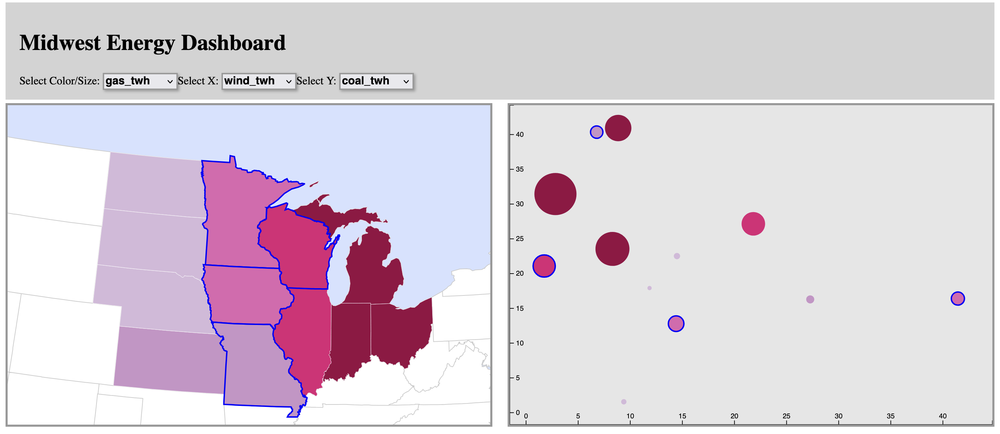

###### Figure 2.1: Linked highlighting

> ### **Implement highlighting on your choropleth map and linked visualization.**

### II. Dehighlighting

The `dehighlight()` function is more challenging to implement than the `highlight()` function because the enumeration units and bars have different original border styles. One solution is to use the exact same style for both map and chart; this may not be possible depending on the type of linked visualization you chose to implement. Another choice is to hardcode each style as a global variable and create separate selections for map elements and chart elements to restyle each.

The implementation shown here uses a third method: it takes advantage of CSS classes, as described earlier, so we only have to remove the CSS `selected` CSS class we added in Example 2.1 (Example 2.4).

###### Example 2.4: Adding a `dehighlight()` function in _main.js_

    //function to dehighlight enumeration units and bars
    function dehighlight(props) {
        //change stroke
        var selected = d3.selectAll("." + props.state_abbr)
            .attr("class", function () {
                //get current list of classes for each element
                let elemClasses = this.classList;
                //remove class "selected" from class list
                elemClasses.remove("selected")
                return elemClasses;
            })
    };

In Example 2.4, the `dehighlight()` function begins much the same as the `highlight()` function, creating a `selected` block. We then adjust the `class` attribute of the resulting selection. We use the `.remove()` function to remove the `"selected"` class from the `elemClasses` string. The `.remove()` function allows us to remove variables from within arrays based on their exact values.

This completes the `dehighlight()` function, which needs its own event listeners to call (Example 2.5).

###### Example 2.5: Adding `mouseout` event listeners in _main.js_

            //midwest event listeners
            .on("mouseover", function(event, d){
                highlight(d.properties);
            })
            .on("mouseout", function(event, d){
                dehighlight(d.properties);
            });
    
            //////...
    
            //circle event listeners
            .on("mouseover", function(event, d){
                highlight(d);
            })
            .on("mouseout", function(event, d){
                dehighlight(d);
            });

We now have working linked highlighting and dehighlighting, allowing only one feature to be selected at a time (Figure 2.2).

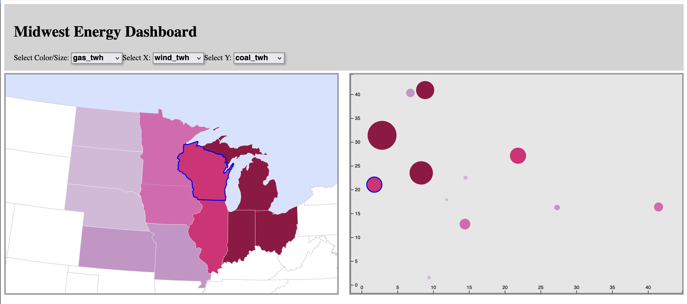

###### Figure 2.2: Linked highlighting and dehighlighting

> ### **Implement dehighlighting on your choropleth map and linked visualization.**

### III. Dynamic Labels

The final task in support of the _retrieve_ interaction operator is implementing a dynamic label (or popup) showing the attribute values for each midwest state. For this tutorial, we implement a simple label that moves with the cursor. To create the dynamic label, write a new `setLabel()` function that makes use of the feature properties (Example 2.6).

###### Example 2.6: Creating the dynamic label in _main.js_

    //function to create dynamic label
    function setLabel(props) {
        //label content
        var labelAttribute = "<h1>" + props[expressed.color] +
            "</h1><b>" + props.state_abbr + " " + expressed.color + "</b>";

        //create info label div
        var infolabel = d3.select("body")
            .append("div")
            .attr("class", "infolabel")
            .attr("id", props.state_abbr + "_label")
            .html(labelAttribute);
    };

In Example 2.6, within the `setLabel()` function, first create an HTML string containing an `<h1>` element with the selected attribute value and a `<b>` element with the attribute name (lines 4-5). If these elements needed attributes, it quickly becomes unwieldy to include them in an HTML string, but since they do not, writing an HTML string is a handy shortcut. Next, create the actual label `
` element, giving it `class` and `id` attributes and assigning our HTML string with the `.html()` operator. Finally, add a child `
` to the label to contain the name of the selected region.

Since we want our label to show up whenever the user highlights a region or bar, now can call `setLabel()` from within `highlight()`, passing it the `props` variable as a parameter. To make sure our labels do not stack up in the DOM, we need to remove each new label on `dehighlight()` as well (Example 2.7).

###### Example 2.7: Removing the info label on dehighlight in _main.js_

         //function to highlight enumeration units and bars
        function highlight(props) {
            //create label
            setLabel(props)
            ////...
        }
        //function to dehighlight enumeration units and bars
            function dehighlight(props) {
                //remove label
                d3.select(".infolabel")
                    .remove();
            ////...
        }

Without any styles applied to it, the label will look pretty messy. Let's style it in _style.css_ (Example 2.8).

###### Example 2.8: Label styles in _style.css_

    .infolabel {
        position: absolute;
        height: 50px;
        min-width: 100px;
        color: #fff;
        background-color: #000;
        border: solid thin #fff;
        padding: 5px 10px;
    }
    
    .infolabel h1 {
        margin: 0 20px 0 0;
        padding: 0;
        display: inline-block;
        line-height: 1em;
    }

These styles create a simple black label with white text (Figure 2.3).

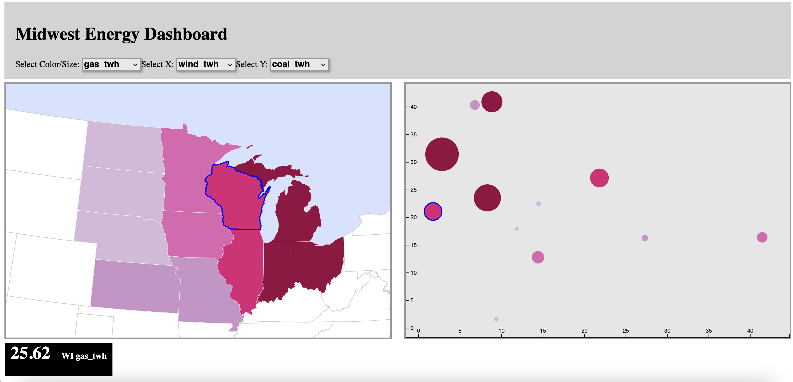

###### Figure 2.3: Styled info label

The next step, of course, is to reposition the label to the cursor. D3 provides a handy object, [`event`](https://github.com/d3/d3-selection/blob/master/README.md#handling-events), that holds the position of the mouse whenever an event is fired on the page. We can use [`event`](https://github.com/d3/d3-selection/blob/master/README.md#handling-events) to set the position of our info label in a function that is called on any `mousemove` event (Example 2.9).

###### Example 2.9: Adding movement to the info label in _main.js_

    //function to move info label with mouse
    function moveLabel(){
        //use coordinates of mousemove event to set label coordinates
        var x = event.clientX + 10,
            y = event.clientY - 75;
    
        d3.select(".infolabel")
            .style("left", x + "px")
            .style("top", y + "px");
    };

In Example 2.9, we retrieve the coordinates of the `mousemove` event and manipulate them to set the bottom-left corner of the label above and to the right of the mouse (lines 4-5). We then pass those coordinate values to the `left` and `top` styles of the label, which we use instead of `margin-left` and `margin-top` because the label's position is set to `absolute` instead of `relative` (lines 7-9). We now need to call this function as an event handler for a `mousemove` event on both the map and chart (Example 2.9).

###### Example 2.10. Adding `mousemove` event listeners in _main.js_

            //Example 2.5 line 1////...midwest event listeners
            .on("mouseover", function(event, d){
                highlight(d.properties);
            })
            .on("mouseout", function(event, d){
                dehighlight(d.properties);
            })
            .on("mousemove", moveLabel);
    
            //////...
    
            //Example 2.5 line 11////...bars event listeners
            .on("mouseover", function(event, d){
                highlight(d);
            })
            .on("mouseover", function(event, d){
                dehighlight(d);
            });
            .on("mousemove", moveLabel);

This should cause our info label to follow our mouse. However, there are two minor issues we need to resolve. First, if the mouse gets too high or too far to the right, the label may overflow the page. Second, depending on your browser speed, you may notice that sometimes the label is added to the page before the position styles take affect, causing it to flash briefly in the corner.

To tackle the first problem, we need to test whether the label has moved off the page, and if so, switch which side of the mouse it appears on. For the vertical (`y`) coordinate, we can test whether the event Y coordinate is less than our desired distance between mouse and upper-left label corner; if it is, then we need to use a vertical coordinate for the label that switches which side of the mouse it is on vertically (Example 2.11).

For the horizontal (`x`) coordinate, since the label is to the right of the mouse by default, we need to check to see if the label overflows the right side of the page. To do this, we need to access the browser window's `innerWidth` property and subtract the width of the label and a desired buffer from it. If the event X coordinate is greater than this number, the label will overflow the right side of the page and should therefore be switched to the left side of the mouse (Example 2.11).

###### Example 2.11: Dynamically switching label position to avoid page overflow in _main.js_

    //function to move label
    function moveLabel(event, d) {
        //text wrapping
        var labelWidth = d3.select(".infolabel")
            .node()
            .getBoundingClientRect().width;
        //use coordinates of mousemove event to set label coordinates
        var x1 = event.clientX + 10,
            y1 = event.clientY - 75,
            x2 = event.clientX - labelWidth - 10,
            y2 = event.clientY + 25;

        //horizontal label coordinate, testing for overflow
        var x = event.clientX > window.innerWidth - labelWidth - 20 ? x2 : x1;
        //vertical label coordinate, testing for overflow
        var y = event.clientY < 75 ? y2 : y1;

        var infoLabel = d3.select(".infolabel")
            .style("top", y + "px")
            .style("left", x + "px")
    }

In Example 2.11, to get the width of the label, we select the label then use the `.node()` operator to return its DOM node (lines 4-5). From there, we can use the native JavaScript [`.getBoundingClientRect()`](https://developer.mozilla.org/en-US/docs/Web/API/Element/getBoundingClientRect) method to return an object containing the size of the label, from which we access its `width` property (line 6). We use this value to set the backup x coordinate that will shift the label to the left of the mouse when it approaches the right side of the page (line 14). After setting our default coordinates (`x1` and `y1`) and backup coordinates (`x2` and `y2`), we perform each overflow test, assigning the backup coordinates if the defaults would overflow the page, and the default coordinates if not (lines 14 and 16).

We now have a label that follows the mouse and switches sides to avoid overflow (Figure 2.4).

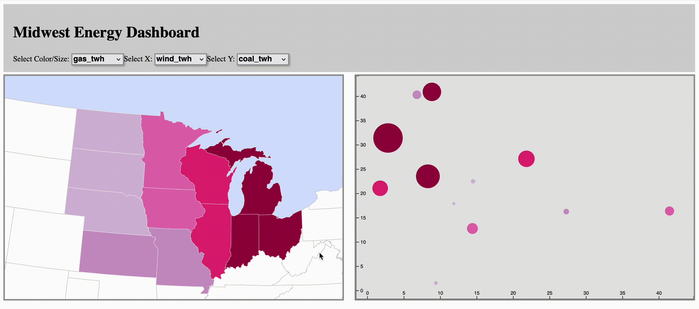

###### Figure 2.4: Dynamic label

> ### **Implement a dynamic label on your choropleth map and linked visualization.*

Lesson 3: (Optional) Additions
--------------------------------------

At this point, your multivariate coordinate visualization is almost done! While we could stop here, there a few small usability additions we can add to the interface. Because these are optional, we'll only briefly describe them.

### I. Responsive Design

A design can be considered responsive if it accounts for different screen sizes. While responsive design is not the focus of the workbook, some small additions to our code can make our design more mobile-friendly.

Our chart and map width are both set to be roughly half the width of the browser. But what if a user tries access the visualization from their phone? They'd see a side-by-side view of a very thin chart and a very thin map—both too small to be usable. To address this, we need to check the width of the browser and adjust the sizes of our visualizations accordingly. Once the width of the browser is identified, we can choose to keep the current width of the chart for large browsers. For smaller browsers, we can set the chart and map size to be the full width of the browser, which will stack both visualizations atop one another.

While we are at it, we can also set both the chart and map height to be the full height of the browser, minus the height of the `<navbar>` element (approximately 170px, though feel free to experiement with different values) (Example 3.1).

###### Example 3.1. Implementing responsive design in _main.js_
    ////...
    var expressed = {
        x: attrArray[2],
        y: attrArray[0],
        color: attrArray[1]
    }
    //chart frame dimensions
    //check size of screen, if over 700 pixels, create a chart container the entire width of the screen.
    //The chart will stack below the map
    if(window.innerWidth < 700)
        var chartWidth = window.innerWidth - 40
    else
        var chartWidth = window.innerWidth * 0.5 - 25

    var chartHeight = window.innerHeight - 170;

    //begin script when window loads
    window.onload = setMap();

    function setMap() {
        //check size of screen, if over 700 pixels, create a map container the entire width of the screen
        //the map will stack atop the chart
        if(window.innerWidth < 700)
            var width = window.innerWidth - 40
        else
            var width = window.innerWidth * 0.5 - 25

        var height = window.innerHeight - 170;
        //create new svg container for the map

### II. Dropdown Styling

Currently, our dropdown menus all use the names of our CSV headers, and they aren't the most descriptive! While we could change the names of the headers in the CSV file, adding spaces and specific characters might create problems in our code. It would be better to implement a naming convention wherein each table header was linked to a particular, human-readable name. Similarly, it would be good to add units to our _retrieve_ popup, as there are multiple units within our dataset.

How can we do all of this at once? Again, the answer lies in object notation (Example 3.2).

###### Example 3.2. Converting `attrArray` to `attrObjects` _main.js_
    (function () {
        //pseudo-global variables
        var attrObjects = [{
            attr:"coal_twh",
            label:"Coal",
            unit:"TeraWatt Hours"
        },
        {
            attr:"gas_twh",
            label:"Natural Gas",
            unit:"TeraWatt Hours"
        },
        {
            attr:"wind_twh",
            label:"Wind",
            unit:"TeraWatt Hours"
        },
        {
            attr:"solar_twh",
            label:"Solar",
            unit:"TeraWatt Hours"
        },
        {
            attr:"cents_kwh",
            label:"Price",
            unit:"Cents per KwH"
        },
        {
            attr:"tot_twh",
            label:"Total",
            unit:"TerraWatt Hours"
        }]    

Not shown: updating every instance of `attrArray` to `attrObjects` with the correct property. We also need to add a `loop` and an `if` statement to the declaration of the `titleOption` variable in the `createDropdown()` function. For a more detailed view, check the *_Chapter_11_Solutions* folder.

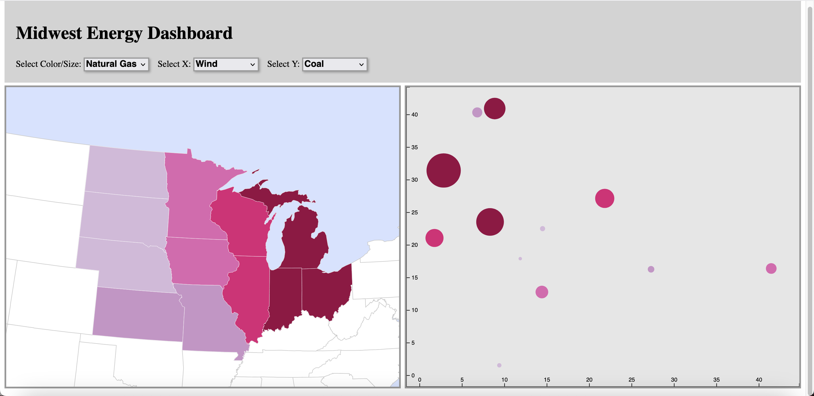

###### Figure 3.1: An interface with labeled dropdowns!

Extending Your Coordinated Visualization
--------------------------------------

Here ends the tutorials related to constructing your multivariate coordinated visualization////...but your work is not over! If you chose to begin by following the tutorial examples, it is now time to implement your own custom UI/UX design. You should use the principles of cartographic design and interaction that you have learned up to this point to push beyond the basic requirements of the D3 map and make your final product visually stunning and an experience your users will remember.

Consider implementing the following components that have not been covered in these chapters:

*   A dynamic choropleth legend that updates on attribute sequencing
    
*   Other interaction operators that make sense given your dataset (_zoom, pan, search, filter, reexpress, overlay, resymbolize, reproject, arrange,_ or _calculate_)
    
*   Additional coordinated data visualizations
    
*   Metadata and other supplementary information about the topic of your coordinated visualization

*   Adjustments to the site style through CSS
    
*   Any other tools or features that add to the utility, usability, and/or aesthetics of the coordinated visualization
    
There is only so much you can learn from following along with written tutorials. You have probably already grappled with making use of online examples, documentation, and help forums to do something awesome. We have tried to open the door for you; to become a professional-level web mapper, you need to dive in and figure out the rest on your own. If you have made it this far, you should feel highly confident in your ability to do so!

> ### **Add logical additional features to your coordinated visualization and finalize its user interface design.**

_This work is licensed under a [Creative Commons Attribution 4.0 International License](http://creativecommons.org/licenses/by/4.0/).   For more information, please contact Robert E. Roth \(reroth@wisc.edu\)._

### [Return Home](../../../) | [Previous Chapter](../Chapter10)
